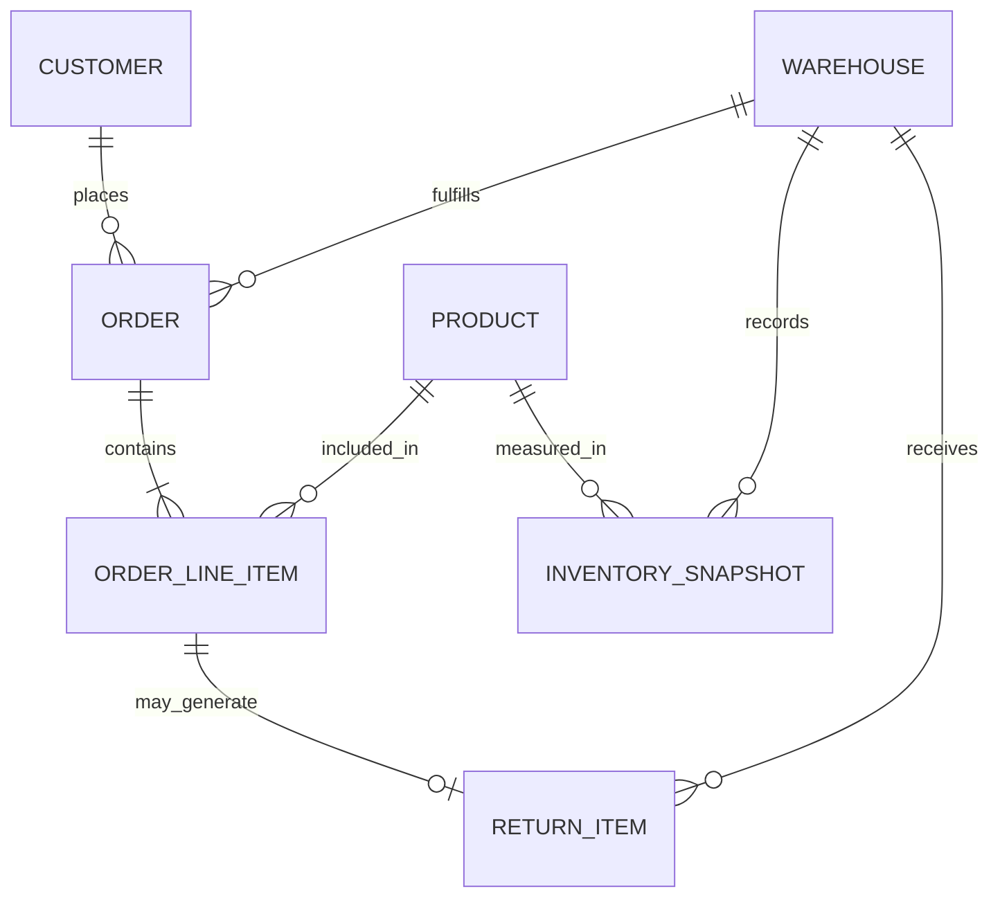

# Logical Data Model

**Project:** Vespera Analytics Platform  
**Sprint:** 2 – Enterprise Architecture  
**Document Version:** 1.2  
**Status:** Approved  

> **v1.2 change note:** Reconciled against the actual Python-generated raw data (see `03_engineering/00_data_generation_assumptions.md`). Removed `STORE` as a separate entity — physical stores are a `Warehouse_Type` value on the single `WAREHOUSE` entity — and removed `PRODUCTION_BATCH`, since no manufacturing source data exists. Sales channel moved from a store attribute to an `ORDER`-level attribute. See Section 6 for the updated mapping matrix.

---

## 1. Purpose

The Logical Data Model (LDM) translates the business concepts defined in the *Enterprise Data Model (Conceptual)* into structured logical entities, attributes, and explicit relationships.

While the conceptual model answers *what business concepts exist*, the logical model defines *how data is structured and related*—independent of physical database engine constraints or warehouse technology.

This document serves as the bridge between business definitions and physical data architecture by establishing:

- Logical entity definitions and logical attributes
- Natural business keys for operational entity identification
- Explicit relationship cardinalities (one-to-one, one-to-many, many-to-many)
- The mapping strategy from operational logical entities to dimensional model objects (Facts vs. Dimensions)

---

## 2. Conceptual-to-Logical Translation Strategy

To evolve the conceptual domain into a logical structure, entities are classified based on their role in the enterprise data lifecycle:

1. **Master Entities → Logical Dimension Entities**  
   Represent primary business objects that provide descriptive context (e.g., `CUSTOMER`, `PRODUCT`, `WAREHOUSE`).

2. **Transactional Event Entities → Logical Fact Entities**  
   Represent business events, state changes, or measurable interactions (e.g., `ORDER`, `INVENTORY_SNAPSHOT`, `RETURN_ITEM`).

3. **Bridge & Association Entities**  
   Represent associative business concepts that connect transactional and master entities where complex business relationships exist (e.g., `ORDER_LINE_ITEM`).

---

## 3. Key Modeling Assumptions

To preserve architectural clarity across domains, the logical model relies on the following business assumptions:

- **Single SKU per Line Item:** An order line item represents a single product SKU purchased at a specific quantity, price, and discount level.
- **Warehouse as the Single Location Entity:** Vespera does not operate a separate retail store network with its own master data; physical stores are one `warehouse_type` value (`Retail Store`) alongside Distribution Centers and the Returns Center within a single `WAREHOUSE` entity. There is no independent `STORE` entity.
- **Channel is an Order Attribute, Not a Location Attribute:** Sales channel (Shopify, Shopee, Lazada, Retail) is recorded on the `ORDER` itself, not on the fulfilling `WAREHOUSE`. A single warehouse can fulfill orders placed through multiple channels.
- **Direct Supplier-to-Warehouse Procurement:** Supplier relationships cover finished-goods procurement shipped directly to a warehouse; no intermediate manufacturing batch or DC-to-store transfer process is modeled.
- **Unified Global Customer Profile:** Individuals purchasing across online storefronts, physical stores, or regional marketplaces resolve to a single logical customer entity.

---

## 4. High-Level Logical Entity Relationship Diagram (ERD)

The diagram below illustrates the logical entities, primary business keys, and relationship cardinalities across Vespera's value chain.

> **Note:** `SUPPLIER`'s role in procurement (`fact_purchase_orders`) is not yet represented as a logical entity relationship in this diagram — a pre-existing gap independent of this revision, called out here rather than silently left in place. Worth closing out alongside the dbt mart build.

---

## 5. Logical Entity Specifications

### 5.1 Master Data Entities (Dimension Precursors)

#### CUSTOMER

Represents a unified individual purchasing or interacting across Vespera touchpoints.

- **Natural Business Key:** `Customer_Email` / `Global_Customer_ID`
- **Logical Attributes:** First Name, Last Name, Primary Phone, Signup Date, Preferred Language, Loyalty Tier, Acquisition Channel
- **Cardinality & Relationships:**
  - One `CUSTOMER` places zero, one, or many `ORDER` records (1:N).

---

#### PRODUCT

Represents a unique stock-keeping unit (SKU) commercialized across channels.

- **Natural Business Key:** `SKU_Code`
- **Logical Attributes:** Product Name, Brand, Category Name, Subcategory Name, Color, Size, MSRP, Base Unit Cost, Season Code, Discontinuation Status
- **Cardinality & Relationships:**
  - One `PRODUCT` appears in zero, one, or many `ORDER_LINE_ITEM` records (1:N).
  - One `PRODUCT` is measured in zero, one, or many `INVENTORY_SNAPSHOT` records (1:N).

---

#### WAREHOUSE

Represents a physical facility that stocks, ships, and receives inventory — Distribution Center, Retail Store, or Returns Center. This is the single conformed location entity for Vespera; there is no separate `STORE` entity, since retail storefronts are simply one `Warehouse_Type` value alongside Distribution Centers and the Returns Center, sharing one master data source.

- **Natural Business Key:** `Warehouse_Code`
- **Logical Attributes:** Warehouse Name, Warehouse Type (Distribution Center, Retail Store, Returns Center), Country, City, Region, Serves Countries (list of countries this facility is eligible to fulfill orders for)
- **Cardinality & Relationships:**
  - One `WAREHOUSE` fulfills zero, one, or many `ORDER` records (1:N).
  - One `WAREHOUSE` records zero, one, or many `INVENTORY_SNAPSHOT` measurements (1:N).
  - One `WAREHOUSE` receives zero, one, or many `RETURN_ITEM` records (1:N).

---

#### SUPPLIER

Represents an external vendor supplying finished goods for procurement.

- **Natural Business Key:** `Vendor_Code`
- **Logical Attributes:** Vendor Name, Country, Primary Contact, Quality Audit Rating, Payment Terms Code
- **Cardinality & Relationships:**
  - One `SUPPLIER` supplies zero, one, or many purchase order line items (relationship not yet modeled as a distinct logical entity — see note in Section 4).

---

### 5.2 Commercial & Operational Entities (Fact Precursors)

#### ORDER

Represents a commercial transaction initiated by a customer.

- **Natural Business Key:** `Order_Number`
- **Logical Attributes:** Order Date/Timestamp, Sales Channel (Shopify, Shopee, Lazada, Retail), Fulfillment Status, Payment Status, Currency Code, Order Subtotal, Discount Total, Tax Total, Shipping Charge Total, Order Grand Total
- **Cardinality & Relationships:**
  - One `ORDER` belongs to exactly one `CUSTOMER` (N:1).
  - One `ORDER` is fulfilled by exactly one `WAREHOUSE` (N:1). Sales Channel is an attribute of the order itself, not of the fulfilling warehouse — the same warehouse can fulfill orders from multiple channels.
  - One `ORDER` contains one or many `ORDER_LINE_ITEM` records (1:N).

---

#### ORDER_LINE_ITEM

Represents an individual product item and quantity purchased as part of a customer order.

- **Natural Business Key:** `Order_Number` + `Line_Item_Number`
- **Logical Attributes:** Quantity Ordered, Unit List Price, Unit Selling Price, Extended Discount Amount, Line Item Net Amount, Line Tax Amount
- **Cardinality & Relationships:**
  - Many `ORDER_LINE_ITEM` records belong to one `ORDER` (N:1).
  - Many `ORDER_LINE_ITEM` records reference one `PRODUCT` (N:1).
  - One `ORDER_LINE_ITEM` may generate zero or one `RETURN_ITEM` (1:0..1).

---

#### INVENTORY_SNAPSHOT

Represents periodic measurements of inventory levels across warehouse facilities.

- **Natural Business Key:** `Facility_Code` + `SKU_Code` + `Snapshot_Date`
- **Logical Attributes:** Snapshot Date, Quantity On Hand, Quantity Allocated, Quantity In Transit, Reorder Point Threshold, Unit Valuation Cost
- **Cardinality & Relationships:**
  - Belongs to one `WAREHOUSE` (N:1).
  - References one `PRODUCT` (N:1).

---

#### RETURN_ITEM

Represents a post-purchase return event for an individual order line item.

- **Natural Business Key:** `Return_Authorization_Number`
- **Logical Attributes:** Return Date, Returned Quantity, Refund Amount, Restocking Fee Amount, Disposition Code (Restock, Defective, Destroy), Customer Return Reason
- **Cardinality & Relationships:**
  - Links to exactly one `ORDER_LINE_ITEM` (1:1).
  - Received by exactly one `WAREHOUSE` (N:1).

---

## 6. Logical-to-Dimensional (Star Schema) Mapping Matrix

The table below illustrates how logical entities transition into the dimensional warehouse model.

| **Logical Entity** | **Primary Role** | **Target Dimensional Table** | **Analytical Grain** | **Representative Attributes** |
|--------------------|------------------|------------------------------|----------------------|-------------------------------|
| **CUSTOMER** | Conformed Dimension | `Dim_Customer` | One row per unique customer | Customer Email, Loyalty Tier, Primary City |
| **PRODUCT** | Conformed Dimension | `Dim_Product` | One row per unique SKU | SKU, Category, Brand, Base Cost, MSRP |
| **WAREHOUSE** | Conformed Dimension | `Dim_Warehouse` | One row per warehouse | Warehouse Code, Warehouse Type, Country, Serves Countries |
| **SUPPLIER** | Conformed Dimension | `Dim_Supplier` | One row per supplier | Vendor Code, Quality Rating, Payment Terms |
| **ORDER_LINE_ITEM** | Transaction Fact | `Fact_Sales` | One row per order line item | Quantity, Selling Price, Net Sales, Sales Channel (degenerate) |
| **INVENTORY_SNAPSHOT** | Snapshot Fact | `Fact_Inventory_Snapshot` | One row per SKU, warehouse, and snapshot date | Quantity on Hand, Inventory Value |
| **RETURN_ITEM** | Transaction Fact | `Fact_Returns` | One row per returned order line item | Return Date, Refund Amount, Return Reason |

> **Not modeled:** `Dim_Promotion` and `Fact_Manufacturing` were dropped from scope entirely — no promotion/discount-campaign source data or manufacturing batch source data exists in the raw layer (`raw_marketing_spend` captures channel-level ad spend, not order-level promotions). Re-introduce only if a future data generation pass adds real source tables for them.

---

## 7. Architectural Scope & Exclusions

This Logical Data Model intentionally excludes physical implementation details, including:

- Surrogate key generation strategies
- Physical database data types
- Primary and foreign key constraints
- Indexing, partitioning, and clustering strategies
- Warehouse-specific DDL syntax
- ETL or ELT implementation logic

These implementation details are introduced in the subsequent architecture documents:

- `03_star_schema.md`
- `04_physical_erd.md`
- `05_data_dictionary.md`