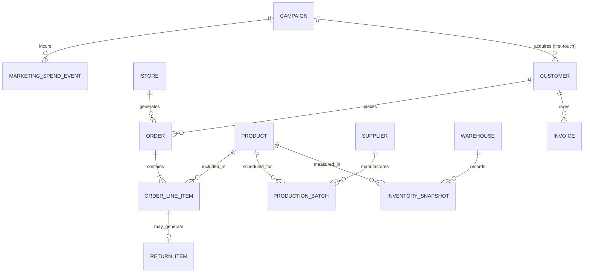

# Logical Data Model

**Project:** Vespera Analytics Platform  
**Sprint:** 2 – Enterprise Architecture  
**Document Version:** 1.2  
**Status:** Approved  
**Change Log (v1.2):** Added `INVOICE` and `CAMPAIGN` logical entities to close the DSO and CAC gaps identified in KPI Framework reconciliation. See `06_kpi_schema_reconciliation.md`.

---

## 1. Purpose

The Logical Data Model (LDM) translates the business concepts defined in the *Enterprise Data Model (Conceptual)* into structured logical entities, attributes, and explicit relationships.

While the conceptual model answers *what business concepts exist*, the logical model defines *how data is structured and related*—independent of physical database engine constraints or warehouse technology.

This document serves as the bridge between business definitions and physical data architecture by establishing:

- Logical entity definitions and logical attributes
- Natural business keys for operational entity identification
- Explicit relationship cardinalities (one-to-one, one-to-many, many-to-many)
- The mapping strategy from operational logical entities to dimensional model objects (Facts vs. Dimensions)

---

## 2. Conceptual-to-Logical Translation Strategy

To evolve the conceptual domain into a logical structure, entities are classified based on their role in the enterprise data lifecycle:

1. **Master Entities → Logical Dimension Entities**  
   Represent primary business objects that provide descriptive context (e.g., `CUSTOMER`, `PRODUCT`, `STORE`).

2. **Transactional Event Entities → Logical Fact Entities**  
   Represent business events, state changes, or measurable interactions (e.g., `ORDER`, `INVENTORY_SNAPSHOT`, `PRODUCTION_BATCH`).

3. **Bridge & Association Entities**  
   Represent associative business concepts that connect transactional and master entities where complex business relationships exist (e.g., `ORDER_LINE_ITEM`, `PROMOTION_REDEMPTION`).

---

## 3. Key Modeling Assumptions

To preserve architectural clarity across domains, the logical model relies on the following business assumptions:

- **Single SKU per Line Item:** An order line item represents a single product SKU purchased at a specific quantity, price, and discount level.
- **One Product per Production Batch:** Each production batch manufactures units of a single product SKU.
- **Vendor-Driven Manufacturing:** Supplier relationships cover both third-party finished goods procurement and contracted manufacturing batch execution.
- **Unified Global Customer Profile:** Individuals purchasing across online storefronts, physical boutiques, or regional marketplaces resolve to a single logical customer entity.

---

## 4. High-Level Logical Entity Relationship Diagram (ERD)

The diagram below illustrates the logical entities, primary business keys, and relationship cardinalities across Vespera's value chain.

---

## 5. Logical Entity Specifications

### 5.1 Master Data Entities (Dimension Precursors)

#### CUSTOMER

Represents a unified individual purchasing or interacting across Vespera touchpoints.

- **Natural Business Key:** `Customer_Email` / `Global_Customer_ID`
- **Logical Attributes:** First Name, Last Name, Primary Phone, Signup Date, Preferred Language, Loyalty Tier, Acquisition Channel, Acquisition Campaign *(v1.2 — first-touch attribution reference to `CAMPAIGN`)*
- **Cardinality & Relationships:**
  - One `CUSTOMER` places zero, one, or many `ORDER` records (1:N).
  - One `CUSTOMER` owes zero, one, or many `INVOICE` records (1:N). *(Added v1.2)*
  - One `CUSTOMER` is acquired by zero or one `CAMPAIGN` via first-touch attribution (N:1). *(Added v1.2)*

---

#### PRODUCT

Represents a unique stock-keeping unit (SKU) commercialized across channels.

- **Natural Business Key:** `SKU_Code`
- **Logical Attributes:** Product Name, Brand, Category Name, Subcategory Name, Color, Size, MSRP, Base Unit Cost, Season Code, Discontinuation Status
- **Cardinality & Relationships:**
  - One `PRODUCT` appears in zero, one, or many `ORDER_LINE_ITEM` records (1:N).
  - One `PRODUCT` is manufactured through zero, one, or many `PRODUCTION_BATCH` records (1:N).
  - One `PRODUCT` is measured in zero, one, or many `INVENTORY_SNAPSHOT` records (1:N).

---

#### STORE

Represents a physical boutique, e-commerce storefront, or digital marketplace channel.

- **Natural Business Key:** `Store_Code`
- **Logical Attributes:** Store Name, Channel Class (Retail, Web, Marketplace), Country Code, Region Name, Local Currency, Opening Date, Operating Status
- **Cardinality & Relationships:**
  - One `STORE` generates zero, one, or many `ORDER` records (1:N).

---

#### WAREHOUSE

Represents a physical fulfillment center or storage facility.

- **Natural Business Key:** `Facility_Code`
- **Logical Attributes:** Warehouse Name, Facility Type, Country, City, Maximum Unit Capacity, Operating Status
- **Cardinality & Relationships:**
  - One `WAREHOUSE` records zero, one, or many `INVENTORY_SNAPSHOT` measurements (1:N).

---

#### SUPPLIER

Represents an external vendor, raw material provider, or contract manufacturing partner.

- **Natural Business Key:** `Vendor_Code`
- **Logical Attributes:** Vendor Name, Country, Primary Contact, Quality Audit Rating, Payment Terms Code
- **Cardinality & Relationships:**
  - One `SUPPLIER` manufactures zero, one, or many `PRODUCTION_BATCH` records (1:N).

---

#### CAMPAIGN *— Added v1.2*

Represents a paid marketing campaign run on an external advertising platform.

- **Natural Business Key:** `Campaign_ID` (platform-issued)
- **Logical Attributes:** Campaign Name, Marketing Platform (Meta, Google, TikTok), Objective Type, Start Date, End Date
- **Cardinality & Relationships:**
  - One `CAMPAIGN` incurs zero, one, or many `MARKETING_SPEND_EVENT` records (1:N).
  - One `CAMPAIGN` acquires zero, one, or many `CUSTOMER` records via first-touch attribution (1:N).

---

### 5.2 Commercial & Operational Entities (Fact Precursors)

#### ORDER

Represents a commercial transaction initiated by a customer.

- **Natural Business Key:** `Order_Number`
- **Logical Attributes:** Order Date/Timestamp, Fulfillment Status, Payment Status, Currency Code, Order Subtotal, Discount Total, Tax Total, Shipping Charge Total, Order Grand Total
- **Cardinality & Relationships:**
  - One `ORDER` belongs to exactly one `CUSTOMER` (N:1).
  - One `ORDER` belongs to exactly one `STORE` (N:1).
  - One `ORDER` contains one or many `ORDER_LINE_ITEM` records (1:N).

---

#### ORDER_LINE_ITEM

Represents an individual product item and quantity purchased as part of a customer order.

- **Natural Business Key:** `Order_Number` + `Line_Item_Number`
- **Logical Attributes:** Quantity Ordered, Unit List Price, Unit Selling Price, Extended Discount Amount, Line Item Net Amount, Line Tax Amount
- **Cardinality & Relationships:**
  - Many `ORDER_LINE_ITEM` records belong to one `ORDER` (N:1).
  - Many `ORDER_LINE_ITEM` records reference one `PRODUCT` (N:1).
  - One `ORDER_LINE_ITEM` may generate zero or one `RETURN_ITEM` (1:0..1).

---

#### INVENTORY_SNAPSHOT

Represents periodic measurements of inventory levels across warehouse facilities.

- **Natural Business Key:** `Facility_Code` + `SKU_Code` + `Snapshot_Date`
- **Logical Attributes:** Snapshot Date, Quantity On Hand, Quantity Allocated, Quantity In Transit, Reorder Point Threshold, Unit Valuation Cost
- **Cardinality & Relationships:**
  - Belongs to one `WAREHOUSE` (N:1).
  - References one `PRODUCT` (N:1).

---

#### PRODUCTION_BATCH

Represents a manufacturing batch producing units of a specific product.

- **Natural Business Key:** `Batch_Number`
- **Logical Attributes:** Batch Start Date, Completion Date, Units Planned, Units Produced, Units Passed QA, Defect Units, Quality Grade
- **Cardinality & Relationships:**
  - Executed by one `SUPPLIER` (N:1).
  - Produces units of one `PRODUCT` (N:1).

---

#### RETURN_ITEM

Represents a post-purchase return event for an individual order line item.

- **Natural Business Key:** `Return_Authorization_Number`
- **Logical Attributes:** Return Date, Returned Quantity, Refund Amount, Disposition Code (Restock, Defective, Destroy), Customer Return Reason
- **Cardinality & Relationships:**
  - Links to exactly one `ORDER_LINE_ITEM` (1:1).

---

#### INVOICE *— Added v1.2*

Represents an open or settled customer receivable balance, snapshotted daily to support cash collection reporting. Closes the DSO gap identified in KPI Framework reconciliation.

- **Natural Business Key:** `Invoice_Number` + `Snapshot_Date`
- **Logical Attributes:** Snapshot Date, Payment Terms Code, Invoice Amount, Open Balance Amount, Days Outstanding, Aging Bucket Amounts
- **Cardinality & Relationships:**
  - Belongs to one `CUSTOMER` (N:1).

---

#### MARKETING_SPEND_EVENT *— Added v1.2*

Represents daily ad spend and platform-reported performance for a marketing campaign. Closes the CAC gap identified in KPI Framework reconciliation.

- **Natural Business Key:** `Campaign_ID` + `Marketing_Platform` + `Spend_Date`
- **Logical Attributes:** Spend Date, Spend Amount, Impressions, Clicks, Platform-Reported Conversions
- **Cardinality & Relationships:**
  - Belongs to one `CAMPAIGN` (N:1).

---

## 6. Logical-to-Dimensional (Star Schema) Mapping Matrix

The table below illustrates how logical entities transition into the dimensional warehouse model.

| **Logical Entity** | **Primary Role** | **Target Dimensional Table** | **Analytical Grain** | **Representative Attributes** |
|--------------------|------------------|------------------------------|----------------------|-------------------------------|
| **CUSTOMER** | Conformed Dimension | `Dim_Customer` | One row per unique customer | Customer Email, Loyalty Tier, Primary City |
| **PRODUCT** | Conformed Dimension | `Dim_Product` | One row per unique SKU | SKU, Category, Brand, Base Cost, MSRP |
| **STORE** | Conformed Dimension | `Dim_Store` | One row per store/channel | Store Code, Channel Class, Currency |
| **WAREHOUSE** | Conformed Dimension | `Dim_Warehouse` | One row per warehouse | Facility Code, Country, Capacity |
| **SUPPLIER** | Conformed Dimension | `Dim_Supplier` | One row per supplier | Vendor Code, Quality Rating, Payment Terms |
| **ORDER_LINE_ITEM** | Transaction Fact | `Fact_Sales` | One row per order line item | Quantity, Selling Price, Net Sales |
| **INVENTORY_SNAPSHOT** | Snapshot Fact | `Fact_Inventory_Snapshot` | One row per SKU, warehouse, and snapshot date | Quantity on Hand, Inventory Value |
| **PRODUCTION_BATCH** | Accumulating Fact | `Fact_Manufacturing` | One row per production batch | Units Produced, QA Passed, Defect Count |
| **RETURN_ITEM** | Transaction Fact | `Fact_Returns` | One row per returned order line item | Return Date, Refund Amount, Return Reason |
| **CAMPAIGN** *(v1.2)* | Conformed Dimension | `Dim_Campaign` | One row per campaign | Campaign ID, Platform, Objective Type |
| **INVOICE** *(v1.2)* | Snapshot Fact | `Fact_AR_Aging_Daily` | One row per open invoice per snapshot date | Open Balance, Days Outstanding, Aging Buckets |
| **MARKETING_SPEND_EVENT** *(v1.2)* | Transaction Fact | `Fact_Marketing_Spend` | One row per campaign, platform, and spend date | Spend Amount, Impressions, Clicks |

---

## 7. Architectural Scope & Exclusions

This Logical Data Model intentionally excludes physical implementation details, including:

- Surrogate key generation strategies
- Physical database data types
- Primary and foreign key constraints
- Indexing, partitioning, and clustering strategies
- Warehouse-specific DDL syntax
- ETL or ELT implementation logic

These implementation details are introduced in the subsequent architecture documents:

- `03_star_schema.md`
- `04_physical_erd.md`
- `05_data_dictionary.md`