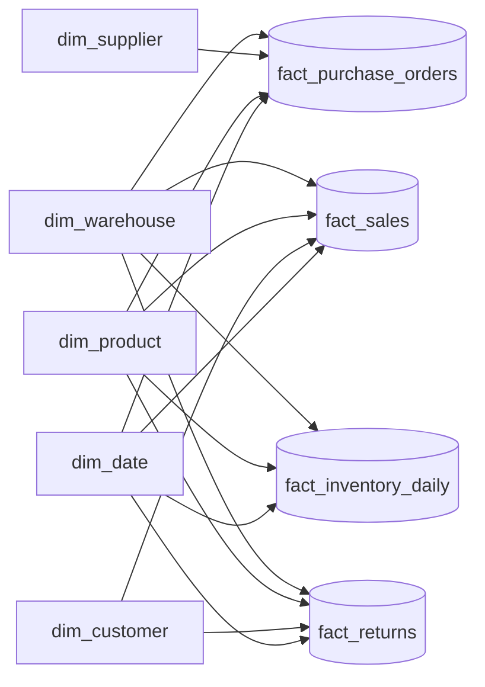
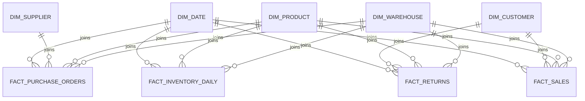
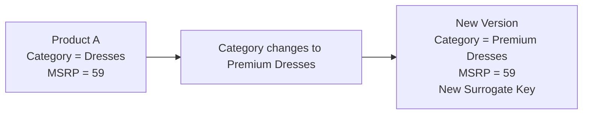
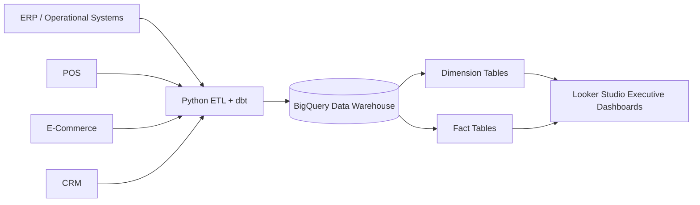

# Star Schema Architectural Specification

**Project:** Vespera Analytics Platform  
**Sprint:** 2 – Enterprise Architecture  
**Document Version:** 1.2  
**Status:** Approved  

> **v1.2 change note:** `dim_store` merged into `dim_warehouse` — Vespera has one physical/fulfillment location entity, not two. `fact_sales` and `fact_returns` now join `dim_warehouse` directly; `sales_channel_code` moves to `fact_sales` as a degenerate dimension. `dim_promotion` and `fact_manufacturing` removed — no corresponding raw source data exists. See `02_logical_data_model.md` v1.2 for the upstream rationale.

---

## 1. Purpose

The Star Schema Specification defines the dimensional modeling architecture for the **Vespera Enterprise Data Warehouse (EDW)**.

Translating the logical entities from `02_logical_data_model.md` into physical dimensional models (Kimball methodology), this document details:
- The **Enterprise Bus Matrix** establishing conformed dimensions across business processes
- The **Enterprise Conformed Dimensions Inventory**
- The **Grain Declaration Policy** and **Measure Classification Definitions**
- Fact table types, explicit grains, and measure definitions across the full enterprise value chain
- Dimension table designs, Slowly Changing Dimension (SCD) policies, and surrogate key standards

---

## 2. Dimensional Architecture Principles

Vespera follows classic **Kimball Dimensional Modeling** principles optimized for cloud data warehouses (Google BigQuery):

1. **Declared Grain First:** Every fact table has an explicitly declared, atomic physical grain. No query aggregation or surrogate key generation occurs before the grain is locked.
2. **Conformed Dimensions:** Key dimensions (`dim_product`, `dim_customer`, `dim_warehouse`, `dim_date`) are standardized across all business processes to ensure consistent cross-process reporting.
3. **Surrogate Keys:** Integer surrogate keys isolate the warehouse from source-system natural key volatility. All dimension tables standardize on surrogate key `-1` for unknown or unmapped members.
4. **Fact Additivity Classification:** Measures are explicitly categorized as fully additive, semi-additive, or non-additive to guide correct SQL aggregation logic in downstream BI tools.

---

## 3. Enterprise Bus Matrix

The Bus Matrix illustrates how conformed dimensions intersect with core enterprise business processes:

| Business Process (Fact Table) | Date | Customer | Product | Warehouse | Supplier |
| :--- | :---: | :---: | :---: | :---: | :---: |
| **Sales Transactions** (`fact_sales`) | X | X | X | X | |
| **Procurement & Purchasing** (`fact_purchase_orders`) | X | | X | X | X |
| **Inventory Snapshots** (`fact_inventory_daily`) | X | | X | X | |
| **Returns & Refunds** (`fact_returns`) | X | X | X | X | |

> Sales channel (Shopify/Shopee/Lazada/Retail) is carried as a degenerate dimension directly on `fact_sales`, not as a conformed dimension — it's an order-level attribute, not a shared master entity.

---

## 4. Enterprise Conformed Dimensions

The following dimensions are shared across multiple business processes and serve as the analytical backbone of the enterprise warehouse:

| Dimension Table | Business Purpose | Primary Natural Key | SCD Strategy |
| :--- | :--- | :--- | :--- |
| `dim_date` | Enterprise calendar & fiscal time intelligence | `full_date` | Static |
| `dim_customer` | Omnichannel customer analytics & segmentation | `global_customer_id` | Type 2 |
| `dim_product` | Merchandise hierarchy & SKU-level product analytics | `sku_code` | Type 2 |
| `dim_supplier` | Vendor management, procurement & lead time tracking | `vendor_code` | Type 1 |
| `dim_warehouse` | Fulfillment facility, retail store & inventory location tracking | `warehouse_code` | Type 1 |

---

## 5. Modeling Standards & Policies

### 5.1 Grain Declaration Policy
Each fact table explicitly declares its analytical grain before attributes, measures, or foreign keys are defined. 

* **Definition:** Grain establishes the lowest atomic level of detail stored in the warehouse and determines the precise meaning of every measure.
* **Strict Constraint:** No fact table may contain mixed grains. Fact tables representing different grains must remain separate entities.

### 5.2 Measure Classification Definitions
To prevent invalid calculations in analytical models, all measures are explicitly categorized into three mathematical behaviors:

* **Fully Additive:** Measures that can be meaningfully summed across every dimension (e.g., `quantity_ordered`, `gross_revenue_amount`).
* **Semi-Additive:** Measures that can be summed across non-time dimensions, but **cannot** be summed across the time dimension. These must be averaged, sampled, or calculated at point-in-time boundaries (e.g., `quantity_on_hand`, `inventory_valuation_amount`).
* **Non-Additive:** Unit rates, ratios, percentages, and prices that **cannot** be directly summed across any dimension. Non-additive metrics must be recalculated from underlying additive components at query runtime (e.g., `unit_selling_price_amount`, `defect_rate_pct`).

---

## 6. Fact Table Specifications

### 6.1 `fact_sales` (Transaction Fact)
Captures line-item level commercial sales activity across physical boutiques, direct web storefronts, and regional marketplaces.

* **Declared Grain:** One row per order line item per transaction.
* **Fact Table Type:** Transaction Fact Table
* **Keys:**
  * `sales_fact_key` (Primary Key - Surrogate)
  * `order_date_key` (FK $\rightarrow$ `dim_date`)
  * `customer_key` (FK $\rightarrow$ `dim_customer`)
  * `product_key` (FK $\rightarrow$ `dim_product`)
  * `warehouse_key` (FK $\rightarrow$ `dim_warehouse`) — the fulfilling warehouse
* **Degenerate Dimensions:** `order_number`, `line_item_number`, `sales_channel_code` (Shopify, Shopee, Lazada, Retail), `payment_method`, `fulfillment_status`
* **Measures:**
  * `quantity_ordered` (Fully Additive Integer)
  * `unit_list_price_amount` (Non-Additive Currency)
  * `unit_selling_price_amount` (Non-Additive Currency)
  * `gross_revenue_amount` (Fully Additive Currency)
  * `discount_amount` (Fully Additive Currency)
  * `tax_amount` (Fully Additive Currency)
  * `net_revenue_amount` (Fully Additive Currency)
  * `cogs_amount` (Fully Additive Currency)

---

### 6.2 `fact_purchase_orders` (Transaction Fact)
Monitors raw material and finished goods procurement from external suppliers to warehouse receiving docks.

* **Declared Grain:** One row per purchase order line item.
* **Fact Table Type:** Transaction Fact Table
* **Keys:**
  * `purchase_order_fact_key` (Primary Key - Surrogate)
  * `po_date_key` (FK $\rightarrow$ `dim_date`)
  * `expected_delivery_date_key` (FK $\rightarrow$ `dim_date`)
  * `supplier_key` (FK $\rightarrow$ `dim_supplier`)
  * `product_key` (FK $\rightarrow$ `dim_product`)
  * `destination_warehouse_key` (FK $\rightarrow$ `dim_warehouse`)
* **Degenerate Dimensions:** `po_number`, `po_line_number`, `po_status_code`
* **Measures:**
  * `ordered_quantity` (Fully Additive Integer)
  * `received_quantity` (Fully Additive Integer)
  * `unit_purchase_cost_amount` (Non-Additive Currency)
  * `total_purchase_cost_amount` (Fully Additive Currency)
  * `lead_time_days` (Fully Additive Integer)
  * `purchase_price_variance_amount` (Fully Additive Currency)

---

### 6.3 `fact_inventory_daily` (Periodic Snapshot Fact)
Captures daily end-of-day stock balances and valuation across fulfillment facilities.

* **Declared Grain:** One row per product SKU per warehouse facility per calendar day.
* **Fact Table Type:** Periodic Snapshot Fact Table
* **Keys:**
  * `inventory_snapshot_key` (Primary Key - Surrogate)
  * `snapshot_date_key` (FK $\rightarrow$ `dim_date`)
  * `product_key` (FK $\rightarrow$ `dim_product`)
  * `warehouse_key` (FK $\rightarrow$ `dim_warehouse`)
* **Measures:**
  * `quantity_on_hand` (Semi-Additive Integer)
  * `quantity_allocated` (Semi-Additive Integer)
  * `quantity_in_transit` (Semi-Additive Integer)
  * `unit_cost_amount` (Non-Additive Currency)
  * `inventory_valuation_amount` (Semi-Additive Currency)

---

> **`fact_manufacturing` removed.** No manufacturing batch source data is generated for Vespera (finished goods are procured directly from suppliers — see `fact_purchase_orders`). Reintroduce this fact only if a future data pass adds a manufacturing/production source table.

### 6.4 `fact_returns` (Transaction Fact)
Monitors post-purchase customer return events, disposition outcomes, and refund calculations.

* **Declared Grain:** One row per returned order line item.
* **Fact Table Type:** Transaction Fact Table
* **Keys:**
  * `return_fact_key` (Primary Key - Surrogate)
  * `return_date_key` (FK $\rightarrow$ `dim_date`)
  * `original_order_date_key` (FK $\rightarrow$ `dim_date`)
  * `customer_key` (FK $\rightarrow$ `dim_customer`)
  * `product_key` (FK $\rightarrow$ `dim_product`)
  * `warehouse_key` (FK $\rightarrow$ `dim_warehouse`)
* **Degenerate Dimensions:** `return_authorization_number`, `disposition_code`, `return_reason_code`
* **Measures:**
  * `returned_quantity` (Fully Additive Integer)
  * `refunded_amount` (Fully Additive Currency)
  * `restocking_fee_amount` (Fully Additive Currency)

---

## 7. Dimension Table Specifications

### 7.1 `dim_product`
* **SCD Strategy:** **Type 2** (Tracks historical changes to price, category, and attributes over time).
* **Key Attributes:**
  * `product_key` (Surrogate Primary Key - Integer)
  * `sku_code` (Natural / Business Key)
  * `product_name`, `style_name`, `brand_name`
  * `category_name`, `subcategory_name`, `collection_name`
  * `color_name`, `size_code`, `season_code`
  * `current_msrp`, `current_base_cost`
  * `effective_start_date`, `effective_end_date`, `is_current_flag` (SCD Type 2 Control)

### 7.2 `dim_customer`
* **SCD Strategy:** **Type 2** (Tracks changes to loyalty tiers, primary region, and preferences).
* **Key Attributes:**
  * `customer_key` (Surrogate Primary Key)
  * `global_customer_id` (Natural Key)
  * `email_address`, `first_name`, `last_name`
  * `loyalty_tier_code`, `acquisition_channel_name`
  * `primary_city_name`, `primary_country_code`
  * `effective_start_date`, `effective_end_date`, `is_current_flag`

### 7.3 `dim_supplier`
* **SCD Strategy:** **Type 1** (Overwrites attribute changes).
* **Key Attributes:**
  * `supplier_key` (Surrogate Primary Key)
  * `vendor_code` (Natural Key)
  * `vendor_name`, `country_code`, `primary_contact_email`
  * `quality_rating_score`, `payment_terms_code`

### 7.4 `dim_warehouse`
* **SCD Strategy:** **Type 1** (Overwrites attribute changes). Single conformed dimension covering Distribution Centers, Retail Stores, and the Returns Center — there is no separate store dimension.
* **Key Attributes:**
  * `warehouse_key` (Surrogate Primary Key)
  * `warehouse_code` (Natural Key)
  * `warehouse_name`, `warehouse_type` (Distribution Center, Retail Store, Returns Center)
  * `country_code`, `city_name`, `region_name`
  * `serves_countries` (array of country codes this facility is eligible to fulfill orders for)

### 7.5 `dim_date`
* **SCD Strategy:** **Static / Non-Changing Dimension** (Pre-populated calendar table covering 2020–2035).
* **Key Attributes:**
  * `date_key` (Format: `YYYYMMDD`)
  * `full_date` (Date Type)
  * `day_of_week_number`, `day_name`, `is_weekend_flag`
  * `week_number`, `calendar_month_number`, `month_name`
  * `calendar_quarter_number`, `calendar_year_number`
  * `fiscal_year_number`, `fiscal_quarter_number`, `fiscal_month_number`
  * `holiday_flag`

---
# Slowly Changing Dimension Strategy

---

# Warehouse Architecture Flow

---

## 8. Surrogate Key & Structural Rules

1. **Surrogate Key Naming:** Dimensions use `<entity>_key` (e.g., `product_key`), generated as incremental integers or MD5/SHA256 deterministic hashes during dbt transformation runs.
2. **Unknown Member Standard:** All dimension tables reserve surrogate key `-1` for **Unknown Members**. Missing, null, or unmapped operational foreign keys default to `-1` to ensure inner/equi-joins never drop fact records during BI reporting.
3. **Date Key Standard:** Dates are modeled as integer keys in `YYYYMMDD` format (e.g., `20260725`) to optimize Google BigQuery partitioning and join performance.

---

## 9. Architectural Scope & Exclusions

This Star Schema Specification intentionally excludes physical DDL syntax and warehouse engine storage configs:
- BigQuery column data types (`STRING`, `INT64`, `NUMERIC`, `TIMESTAMP`)
- Clustering and partitioning field assignments
- Source-to-target dbt SQL transformation models

These physical database specifications are detailed in `04_physical_erd.md` and `05_data_dictionary.md`.