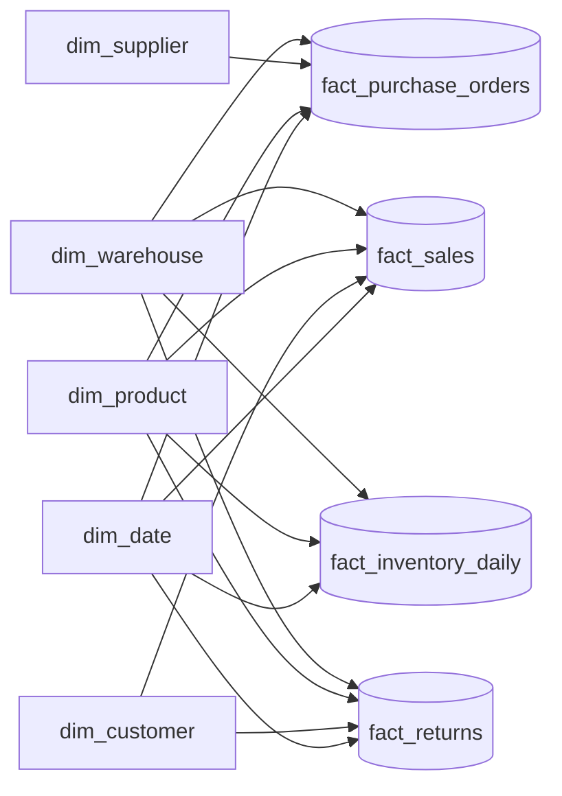
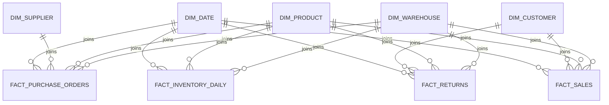

# Star Schema Architectural Specification

**Project:** Vespera Analytics Platform  
**Sprint:** 2 – Enterprise Architecture  
**Document Version:** 1.3  
**Status:** Approved  

> **v1.2 change note:** `dim_store` merged into `dim_warehouse` — Vespera has one physical/fulfillment location entity, not two. `fact_sales` and `fact_returns` now join `dim_warehouse` directly; `sales_channel_code` moves to `fact_sales` as a degenerate dimension. `dim_promotion` and `fact_manufacturing` removed — no corresponding raw source data exists. See `02_logical_data_model.md` v1.2 for the upstream rationale.

> **v1.3 change note:** Reconciled against the actual dbt implementation (`docs/03_engineering/02_dbt_transformation_spec.md`). `dim_product` and `dim_customer` corrected from Type 2 to **Type 1** — the SCD Type 2 tracking columns and rationale were aspirational, never actually built, since there's no real change stream to track yet. `dim_product`'s field list corrected to match what's actually generated (no `color_name`/`size_code`/`season_code`/apparel-specific fields — those were never part of this dataset). `fact_inventory_daily`'s measures corrected — `quantity_allocated`/`quantity_in_transit`/`unit_cost_amount`/`inventory_valuation_amount` removed (only ever existed as a single point-in-time snapshot reading, not a real daily series) and replaced with the actual derived measures (`units_sold_qty`/`units_returned_qty`/`units_received_qty`). `fact_returns.refunded_amount`/`restocking_fee_amount` explicitly marked as derived, not raw-sourced. `fact_sales.commission_amount` and `fact_purchase_orders.purchase_price_variance_amount` documented (both exist in the actual build but weren't previously listed).

---

## 1. Purpose

The Star Schema Specification defines the dimensional modeling architecture for the **Vespera Enterprise Data Warehouse (EDW)**.

Translating the logical entities from `02_logical_data_model.md` into physical dimensional models (Kimball methodology), this document details:
- The **Enterprise Bus Matrix** establishing conformed dimensions across business processes
- The **Enterprise Conformed Dimensions Inventory**
- The **Grain Declaration Policy** and **Measure Classification Definitions**
- Fact table types, explicit grains, and measure definitions across the full enterprise value chain
- Dimension table designs, Slowly Changing Dimension (SCD) policies, and surrogate key standards

---

## 2. Dimensional Architecture Principles

Vespera follows classic **Kimball Dimensional Modeling** principles optimized for cloud data warehouses (Google BigQuery):

1. **Declared Grain First:** Every fact table has an explicitly declared, atomic physical grain. No query aggregation or surrogate key generation occurs before the grain is locked.
2. **Conformed Dimensions:** Key dimensions (`dim_product`, `dim_customer`, `dim_warehouse`, `dim_date`) are standardized across all business processes to ensure consistent cross-process reporting.
3. **Surrogate Keys:** Integer surrogate keys isolate the warehouse from source-system natural key volatility. All dimension tables standardize on surrogate key `-1` for unknown or unmapped members.
4. **Fact Additivity Classification:** Measures are explicitly categorized as fully additive, semi-additive, or non-additive to guide correct SQL aggregation logic in downstream BI tools.

---

## 3. Enterprise Bus Matrix

The Bus Matrix illustrates how conformed dimensions intersect with core enterprise business processes:

| Business Process (Fact Table) | Date | Customer | Product | Warehouse | Supplier |
| :--- | :---: | :---: | :---: | :---: | :---: |
| **Sales Transactions** (`fact_sales`) | X | X | X | X | |
| **Procurement & Purchasing** (`fact_purchase_orders`) | X | | X | X | X |
| **Inventory Snapshots** (`fact_inventory_daily`) | X | | X | X | |
| **Returns & Refunds** (`fact_returns`) | X | X | X | X | |

> Sales channel (Shopify/Shopee/Lazada/Retail) is carried as a degenerate dimension directly on `fact_sales`, not as a conformed dimension — it's an order-level attribute, not a shared master entity.

---

## 4. Enterprise Conformed Dimensions

The following dimensions are shared across multiple business processes and serve as the analytical backbone of the enterprise warehouse:

| Dimension Table | Business Purpose | Primary Natural Key | SCD Strategy |
| :--- | :--- | :--- | :--- |
| `dim_date` | Enterprise calendar & fiscal time intelligence | `full_date` | Static |
| `dim_customer` | Omnichannel customer analytics & segmentation | `customer_id` | Type 1 |
| `dim_product` | Merchandise hierarchy & SKU-level product analytics | `product_id` | Type 1 |
| `dim_supplier` | Vendor management, procurement & lead time tracking | `supplier_id` | Type 1 |
| `dim_warehouse` | Fulfillment facility, retail store & inventory location tracking | `warehouse_code` | Type 1 |

> **All dimensions are currently Type 1**, including `dim_customer` and `dim_product` — a deliberate, documented deferral of Type 2, not an oversight. The raw data is a single point-in-time generation, not a real change stream; implementing full SCD Type 2 mechanics now would mean tracking history that doesn't exist. Revisit with `dbt snapshot` if/when this pipeline runs on a recurring schedule against a source that genuinely changes over time. See `docs/03_engineering/02_dbt_transformation_spec.md` §6.1.

---

## 5. Modeling Standards & Policies

### 5.1 Grain Declaration Policy
Each fact table explicitly declares its analytical grain before attributes, measures, or foreign keys are defined. 

* **Definition:** Grain establishes the lowest atomic level of detail stored in the warehouse and determines the precise meaning of every measure.
* **Strict Constraint:** No fact table may contain mixed grains. Fact tables representing different grains must remain separate entities.

### 5.2 Measure Classification Definitions
To prevent invalid calculations in analytical models, all measures are explicitly categorized into three mathematical behaviors:

* **Fully Additive:** Measures that can be meaningfully summed across every dimension (e.g., `quantity_ordered`, `gross_revenue_amount`).
* **Semi-Additive:** Measures that can be summed across non-time dimensions, but **cannot** be summed across the time dimension. These must be averaged, sampled, or calculated at point-in-time boundaries (e.g., `quantity_on_hand`).
* **Non-Additive:** Unit rates, ratios, percentages, and prices that **cannot** be directly summed across any dimension. Non-additive metrics must be recalculated from underlying additive components at query runtime (e.g., `unit_selling_price_amount`).

---

## 6. Fact Table Specifications

### 6.1 `fact_sales` (Transaction Fact)
Captures line-item level commercial sales activity across physical stores, direct web storefronts, and regional marketplaces.

* **Declared Grain:** One row per order line item per transaction.
* **Fact Table Type:** Transaction Fact Table
* **Keys:**
  * `sales_fact_key` (Primary Key - Surrogate)
  * `order_date_key` (FK $\rightarrow$ `dim_date`)
  * `customer_key` (FK $\rightarrow$ `dim_customer`)
  * `product_key` (FK $\rightarrow$ `dim_product`)
  * `warehouse_key` (FK $\rightarrow$ `dim_warehouse`) — the fulfilling warehouse
* **Degenerate Dimensions:** `order_number`, `line_item_number`, `sales_channel_code` (Shopify, Shopee, Lazada, Retail), `payment_method`, `fulfillment_status`
* **Measures:**
  * `quantity_ordered` (Fully Additive Integer)
  * `unit_list_price_amount` (Non-Additive Currency)
  * `unit_selling_price_amount` (Non-Additive Currency)
  * `gross_revenue_amount` (Fully Additive Currency)
  * `discount_amount` (Fully Additive Currency)
  * `tax_amount` (Fully Additive Currency)
  * `net_revenue_amount` (Fully Additive Currency)
  * `commission_amount` (Fully Additive Currency) — channel commission (Shopee 6%, Lazada 5%, Shopify/Retail 0%), sourced directly from `raw_order_items`
  * `cogs_amount` (Fully Additive Currency) — quantity × the product's **current** `base_cost_sgd`. Since `dim_product` is Type 1, this is current-cost COGS, not cost-as-of-order-date; revisit once/if `dim_product` moves to Type 2.

---

### 6.2 `fact_purchase_orders` (Transaction Fact)
Monitors finished-goods procurement from external suppliers to warehouse receiving docks.

* **Declared Grain:** One row per purchase order. (Each raw source row is already atomic — one supplier/product/warehouse/order_date combination — there's no separate PO-header-vs-line-item split in this source, unlike `fact_sales`.)
* **Fact Table Type:** Transaction Fact Table
* **Keys:**
  * `purchase_order_fact_key` (Primary Key - Surrogate)
  * `po_date_key` (FK $\rightarrow$ `dim_date`)
  * `expected_delivery_date_key` (FK $\rightarrow$ `dim_date`)
  * `supplier_key` (FK $\rightarrow$ `dim_supplier`)
  * `product_key` (FK $\rightarrow$ `dim_product`)
  * `destination_warehouse_key` (FK $\rightarrow$ `dim_warehouse`)
* **Degenerate Dimensions:** `po_number`, `po_status_code`, `demand_tier`
* **Measures:**
  * `ordered_quantity` (Fully Additive Integer)
  * `received_quantity` (Fully Additive Integer)
  * `unit_purchase_cost_amount` (Non-Additive Currency)
  * `total_purchase_cost_amount` (Fully Additive Currency)
  * `lead_time_days` (Fully Additive Integer)
  * `purchase_price_variance_amount` (Fully Additive Currency) — `(unit_purchase_cost_amount − dim_product.base_cost_sgd) × ordered_quantity`, comparing actual cost paid against the product's **current** standard cost (same Type 1 caveat as `fact_sales.cogs_amount`)

---

### 6.3 `fact_inventory_daily` (Periodic Snapshot Fact)
Captures a derived daily on-hand balance per product per warehouse.

* **Declared Grain:** One row per product SKU per warehouse facility per calendar day.
* **Fact Table Type:** Periodic Snapshot Fact Table
* **Derivation:** `raw_inventory_snapshot` is a single point-in-time reading per (warehouse, product), not a daily series. `quantity_on_hand` is reconstructed via a calibrated running total of the signed movement ledger (`raw_inventory_movements`), anchored to the one real snapshot value available, then forward-filled across days with no movement activity. Full methodology in `docs/03_engineering/02_dbt_transformation_spec.md` §5, manually verified against ground truth per §7 of that document.
* **Keys:**
  * `inventory_fact_key` (Primary Key - Surrogate)
  * `snapshot_date_key` (FK $\rightarrow$ `dim_date`)
  * `product_key` (FK $\rightarrow$ `dim_product`)
  * `warehouse_key` (FK $\rightarrow$ `dim_warehouse`)
* **Measures:**
  * `quantity_on_hand` (Semi-Additive Integer) — derived, see above. Small negative values on a handful of (warehouse, product) pairs are expected accepted stockout noise, documented in `00_data_generation_assumptions.md`.
  * `units_sold_qty` (Fully Additive Integer) — same-day total from `CUSTOMER_SALE` movements
  * `units_returned_qty` (Fully Additive Integer) — same-day total from `CUSTOMER_RETURN` movements
  * `units_received_qty` (Fully Additive Integer) — same-day total from `INBOUND_PURCHASE` movements

> **`quantity_allocated`, `quantity_in_transit`, `unit_cost_amount`, and `inventory_valuation_amount` are deliberately NOT included.** An earlier version of this spec listed them, but they only exist in `raw_inventory_snapshot` as a single point-in-time reading — not a real daily-varying series — so fabricating a daily trend for them would be actively misleading, not just incomplete. If these become genuinely needed at daily grain, that requires new raw source data (e.g. a real WMS feed), not a derivation from what exists today.

---

> **`fact_manufacturing` removed.** No manufacturing batch source data is generated for Vespera (finished goods are procured directly from suppliers — see `fact_purchase_orders`). Reintroduce this fact only if a future data pass adds a manufacturing/production source table.

### 6.4 `fact_returns` (Transaction Fact)
Monitors post-purchase customer return events, disposition outcomes, and refund calculations.

* **Declared Grain:** One row per returned order line item.
* **Fact Table Type:** Transaction Fact Table
* **Keys:**
  * `return_fact_key` (Primary Key - Surrogate)
  * `return_date_key` (FK $\rightarrow$ `dim_date`)
  * `original_order_date_key` (FK $\rightarrow$ `dim_date`)
  * `customer_key` (FK $\rightarrow$ `dim_customer`)
  * `product_key` (FK $\rightarrow$ `dim_product`)
  * `warehouse_key` (FK $\rightarrow$ `dim_warehouse`)
* **Degenerate Dimensions:** `return_authorization_number`, `disposition_code`, `return_reason_code`
* **Measures:**
  * `returned_quantity` (Fully Additive Integer) — sourced directly from `raw_returns`
  * `refunded_amount` (Fully Additive Currency) — **derived**, not a raw source column. `raw_returns` doesn't have this field (confirmed absent via `INFORMATION_SCHEMA.COLUMNS`). Computed as returned quantity × the original order line item's actual net unit price (prorated).
  * `restocking_fee_amount` (Fully Additive Currency) — **derived**. 10% of `refunded_amount`, applied only when `return_reason_code = 'Customer Remorse'`, per the business logic described in `00_data_generation_assumptions.md`.

---

## 7. Dimension Table Specifications

### 7.1 `dim_product`
* **SCD Strategy:** **Type 1** (current-state only — see §4 note on deferred Type 2).
* **Key Attributes:**
  * `product_key` (Surrogate Primary Key - Integer, via `FARM_FINGERPRINT`)
  * `product_id` (Natural / Business Key)
  * `sku_code`, `product_name`
  * `category_name`, `brand_name`
  * `base_cost_sgd`, `msrp_sgd`
  * `launch_date`, `lifecycle_status`, `discontinued_date`
  * `popularity_weight` — Pareto-distributed demand-skew weight, drives realistic 80/20 sales concentration
  * `return_rate` — category-level expected return rate
  * `is_currently_sellable` — derived flag (`false` if discontinued or not yet launched)

### 7.2 `dim_customer`
* **SCD Strategy:** **Type 1** (current-state only — see §4 note on deferred Type 2).
* **Key Attributes:**
  * `customer_key` (Surrogate Primary Key, via `FARM_FINGERPRINT`)
  * `customer_id` (Natural Key)
  * `first_name`, `last_name`, `email_address`, `phone_number`
  * `customer_country`, `gender`, `birth_date`, `customer_since`
  * `loyalty_tier` (Bronze, Silver, Gold, Platinum)
  * `acquisition_channel`, `customer_status`

### 7.3 `dim_supplier`
* **SCD Strategy:** **Type 1** (Overwrites attribute changes).
* **Key Attributes:**
  * `supplier_key` (Surrogate Primary Key)
  * `supplier_id` (Natural Key)
  * `supplier_name`, `supplier_tier`, `category_specialty`
  * `supplier_country`, `supplier_currency`
  * `payment_terms`, `lead_time_days`, `quality_rating`, `preferred_supplier`

### 7.4 `dim_warehouse`
* **SCD Strategy:** **Type 1** (Overwrites attribute changes). Single conformed dimension covering Distribution Centers, Retail Stores, and the Returns Center — there is no separate store dimension.
* **Key Attributes:**
  * `warehouse_key` (Surrogate Primary Key)
  * `warehouse_code` (Natural Key)
  * `warehouse_name`, `warehouse_type` (Distribution Center, Retail Store, Returns Center)
  * `warehouse_country`, `warehouse_city`, `warehouse_region`
  * `serves_countries` (countries this facility is eligible to fulfill orders for)

### 7.5 `dim_date`
* **SCD Strategy:** **Static / Non-Changing Dimension** (generated calendar, 2023-01-01 to 2026-12-31 — padded beyond the simulation window to safely cover return dates and PO expected-delivery dates that can land slightly outside it).
* **Key Attributes:**
  * `date_key` (Format: `YYYYMMDD`)
  * `full_date` (Date Type)
  * `day_of_week_number`, `day_name`, `is_weekend_flag`
  * `week_number`, `calendar_month_number`, `month_name`
  * `calendar_quarter_number`, `calendar_year_number`
  * `fiscal_year_number`, `fiscal_quarter_number`, `fiscal_month_number` — assumed identical to calendar; no evidence anywhere of a non-calendar fiscal year
  * `holiday_flag` — simplified heuristic (New Year's, Christmas, and the SEA e-commerce flash-sale dates called out in `config.py`'s seasonality comments: 9/9, 10/10, 11/11, 12/12), not a real per-country public holiday calendar

---
# Slowly Changing Dimension Strategy

> Illustrates SCD Type 1 behavior as actually implemented — a genuine Type 2 example (preserving both old and new versions with surrogate key history) would require a real change stream, which doesn't exist yet. See §4.

---

# Warehouse Architecture Flow

---

## 8. Surrogate Key & Structural Rules

1. **Surrogate Key Naming:** Dimensions use `<entity>_key` (e.g., `product_key`), generated via `FARM_FINGERPRINT()` on the natural key during dbt transformation runs.
2. **Unknown Member Standard:** All dimension tables reserve surrogate key `-1` for **Unknown Members**. Missing, null, or unmapped operational foreign keys default to `-1` via `COALESCE()` in every fact-building model, to ensure joins never drop fact records during BI reporting.
3. **Date Key Standard:** Dates are modeled as integer keys in `YYYYMMDD` format (e.g., `20260725`) to optimize Google BigQuery partitioning and join performance.

---

## 9. Architectural Scope & Exclusions

This Star Schema Specification intentionally excludes physical DDL syntax and warehouse engine storage configs:
- BigQuery column data types (`STRING`, `INT64`, `NUMERIC`, `TIMESTAMP`)
- Clustering and partitioning field assignments
- Source-to-target dbt SQL transformation models

These physical database specifications are detailed in `04_physical_erd.md` and `05_data_dictionary.md`.