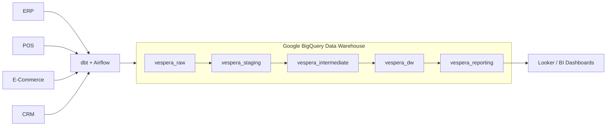
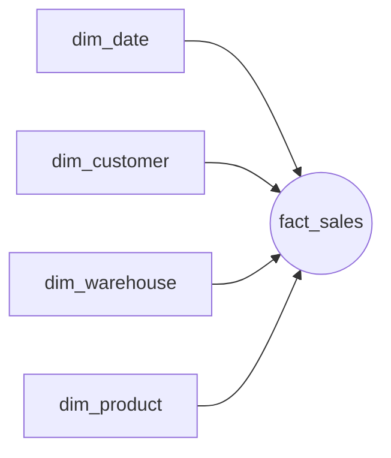
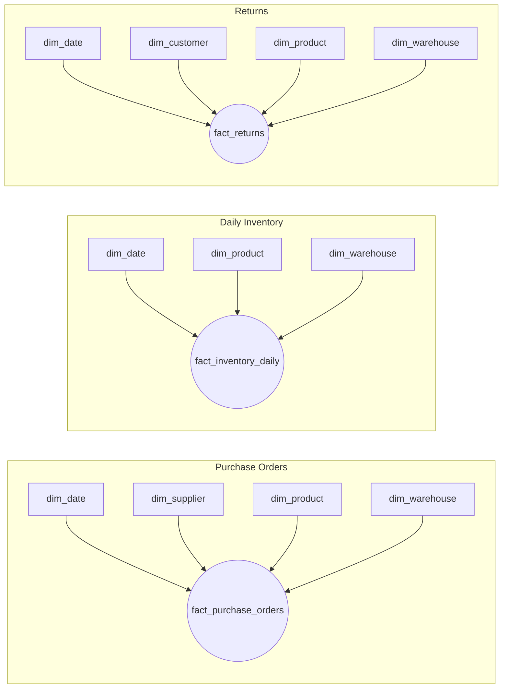
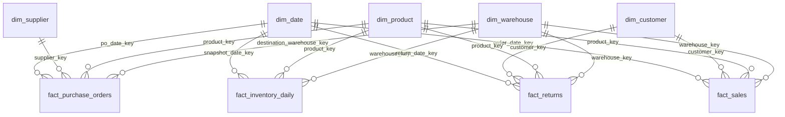

# Physical Entity Relationship Diagram (ERD) & Schema Specification

**Project:** Vespera Analytics Platform  
**Sprint:** 2 – Enterprise Architecture  
**Document Version:** 2.1  
**Status:** Approved  
**Target Engine:** Google BigQuery (Standard SQL)  

> **v2.1 change note:** `dim_store` merged into `dim_warehouse`; `dim_promotion` and `fact_manufacturing` removed (no source data). `warehouse_sk` natural key and type columns renamed `facility_code`/`facility_type` → `warehouse_code`/`warehouse_type` to match the actual source field names in `raw_warehouses`. See `03_star_schema.md` v1.2 for the modeling rationale.

---

## 1. Executive Summary & Purpose

The Physical ERD & Schema Specification translates the dimensional model (`03_star_schema.md`) into executable **Google BigQuery physical warehouse architecture**. 

This document defines storage organization, naming conventions, hashing strategies, indexing patterns, and data pipeline lineage, while relegating raw DDL statements to structured appendix references.

---

## 2. Enterprise Physical Warehouse Architecture

### 2.1 High-Level Data Flow
Data flows from operational source systems into raw BigQuery landing zones, undergoes dbt transformations, and feeds dimensional marts for downstream reporting.



---

### 2.2 GCP Project & Dataset Hierarchy

To maintain security, access control (IAM), and environment isolation, objects are segregated into functional BigQuery datasets:

```
GCP Project: vespera-analytics-prod
├── vespera_raw          (Landing zone for raw, un-transformed JSON/Parquet ingestion)
├── vespera_staging      (Initial light cleaning, renaming, and type casting; 1:1 with source)
├── vespera_intermediate (Complex joins, windowing, and business logic staging)
├── vespera_dw           (Production Star Schema: Fact & Dimension physical tables)
└── vespera_reporting    (Business-facing semantic views, aggregated metrics, and BI layers)
```

### 2.3 Object Naming Conventions

All data platform assets strictly adhere to standard dbt and dimensional modeling naming guidelines:

| Object Type | Standard Pattern | Example | Description |
| :--- | :--- | :--- | :--- |
| **Dimension Tables** | `dim_*` | `dim_customer` | Conformed physical dimension tables |
| **Fact Tables** | `fact_*` | `fact_sales` | Physical grain-level fact tables |
| **Staging Models** | `stg_*` | `stg_shopify__orders` | Lightly cleaned raw source mirrors |
| **Intermediate Models** | `int_*` | `int_sales__line_items` | Business logic & surrogate key preparation |
| **Reporting Views** | `vw_*` or `rpt_*` | `vw_executive_daily_sales` | Semantic layers optimized for BI tools |
| **Snapshots** | `snap_*` | `snap_products` | dbt SCD Type 2 tracking snapshots |

---

## 3. Storage Optimization & Integrity Mechanics

### 3.1 Surrogate Key Hashing Standard
To maintain stateless parallelism across distributed dbt processing nodes, surrogate keys rely on deterministic **FARM_FINGERPRINT** integer hashing over natural keys:

```sql
-- Standard Surrogate Key Generation
FARM_FINGERPRINT(COALESCE(CAST(natural_key AS STRING), '-1')) AS entity_key
```

### 3.2 Primary & Foreign Key Enforcement
BigQuery primary and foreign key constraints are strictly **`NOT ENFORCED`**. They serve as informational metadata for query optimizer hints and BI tool ERD autodiscovery. 

> **Data Integrity Constraint:** Physical referential integrity and non-null guarantees are enforced upstream during build pipelines using **dbt tests** (`unique`, `not_null`, `relationships`).

### 3.3 BigQuery Data Type Conventions
* **`NUMERIC`:** Used for all monetary, cost, and rate figures (defaulting to BigQuery's native 38-digit precision / 9-digit scale). Explicit `NUMERIC(18,2)` parameterization is omitted for engine compatibility.
* **`TIMESTAMP`:** Used for SCD Type 2 tracking (`effective_start_date`, `effective_end_date`) to capture precise pipeline execution timing.
* **`DATE`:** Used for business calendar dates (`full_date`, `snapshot_date`).

---

## 4. Dimensional Star Diagrams

### 4.1 Sales Star Schema


### 4.2 Supply Chain & Inventory Star Schemas


---

## 5. Enterprise Physical ERD & Foreign Key Matrix

### 5.1 Full Warehouse Physical ERD


### 5.2 Foreign Key Reference Matrix

| Fact Table | Foreign Key Field | Target Dimension | Optimization Strategy |
| :--- | :--- | :--- | :--- |
| **`fact_sales`** | `order_date_key` | `dim_date.date_key` | Partition: `DATE(order_timestamp)` |
| | `customer_key` | `dim_customer.customer_key` | Cluster Key |
| | `product_key` | `dim_product.product_key` | Cluster Key |
| | `warehouse_key` | `dim_warehouse.warehouse_key` | Cluster Key |
| **`fact_purchase_orders`** | `po_date_key` | `dim_date.date_key` | Partition: `DATE(po_timestamp)` |
| | `supplier_key` | `dim_supplier.supplier_key` | Cluster Key |
| | `product_key` | `dim_product.product_key` | Cluster Key |
| | `destination_warehouse_key` | `dim_warehouse.warehouse_key` | Attribute Join |
| **`fact_inventory_daily`** | `snapshot_date_key` | `dim_date.date_key` | Partition: `snapshot_date` |
| | `product_key` | `dim_product.product_key` | Cluster Key |
| | `warehouse_key` | `dim_warehouse.warehouse_key` | Cluster Key |
| **`fact_returns`** | `return_date_key` | `dim_date.date_key` | Partition: `DATE(return_timestamp)` |
| | `customer_key` | `dim_customer.customer_key` | Attribute Join |
| | `product_key` | `dim_product.product_key` | Cluster Key |
| | `warehouse_key` | `dim_warehouse.warehouse_key` | Cluster Key |

---

## Appendix A: Dimension Table DDLs (`vespera_dw`)

```sql
-- dim_date
CREATE TABLE IF NOT EXISTS vespera_dw.dim_date (
    date_key INT64 NOT NULL,
    full_date DATE NOT NULL,
    day_of_week_number INT64 NOT NULL,
    day_name STRING NOT NULL,
    is_weekend_flag BOOL NOT NULL,
    week_number INT64 NOT NULL,
    calendar_month_number INT64 NOT NULL,
    month_name STRING NOT NULL,
    calendar_quarter_number INT64 NOT NULL,
    calendar_year_number INT64 NOT NULL,
    fiscal_year_number INT64 NOT NULL,
    fiscal_quarter_number INT64 NOT NULL,
    fiscal_month_number INT64 NOT NULL,
    holiday_flag BOOL NOT NULL,
    PRIMARY KEY (date_key) NOT ENFORCED
);

-- dim_product (SCD Type 2)
CREATE TABLE IF NOT EXISTS vespera_dw.dim_product (
    product_key INT64 NOT NULL,
    sku_code STRING NOT NULL,
    product_name STRING NOT NULL,
    style_name STRING,
    brand_name STRING NOT NULL,
    category_name STRING NOT NULL,
    subcategory_name STRING,
    collection_name STRING,
    color_name STRING,
    size_code STRING,
    season_code STRING,
    current_msrp NUMERIC,
    current_base_cost NUMERIC,
    effective_start_date TIMESTAMP NOT NULL,
    effective_end_date TIMESTAMP,
    is_current_flag BOOL NOT NULL,
    PRIMARY KEY (product_key) NOT ENFORCED
)
CLUSTER BY sku_code, category_name;

-- dim_customer (SCD Type 2)
CREATE TABLE IF NOT EXISTS vespera_dw.dim_customer (
    customer_key INT64 NOT NULL,
    global_customer_id STRING NOT NULL,
    email_address STRING NOT NULL,
    first_name STRING,
    last_name STRING,
    loyalty_tier_code STRING,
    acquisition_channel_name STRING,
    primary_city_name STRING,
    primary_country_code STRING,
    effective_start_date TIMESTAMP NOT NULL,
    effective_end_date TIMESTAMP,
    is_current_flag BOOL NOT NULL,
    PRIMARY KEY (customer_key) NOT ENFORCED
)
CLUSTER BY global_customer_id, email_address;

-- dim_supplier (SCD Type 1)
CREATE TABLE IF NOT EXISTS vespera_dw.dim_supplier (
    supplier_key INT64 NOT NULL,
    vendor_code STRING NOT NULL,
    vendor_name STRING NOT NULL,
    country_code STRING NOT NULL,
    primary_contact_email STRING,
    quality_rating_score NUMERIC,
    payment_terms_code STRING,
    PRIMARY KEY (supplier_key) NOT ENFORCED
);

-- dim_warehouse (SCD Type 1)
-- Single conformed dimension covering Distribution Centers, Retail Stores,
-- and the Returns Center (warehouse_type) — sourced 1:1 from raw_warehouses.
-- There is no separate dim_store.
CREATE TABLE IF NOT EXISTS vespera_dw.dim_warehouse (
    warehouse_key INT64 NOT NULL,
    warehouse_code STRING NOT NULL,
    warehouse_name STRING NOT NULL,
    warehouse_type STRING NOT NULL,
    country_code STRING NOT NULL,
    city_name STRING,
    region_name STRING,
    serves_countries ARRAY<STRING>,
    PRIMARY KEY (warehouse_key) NOT ENFORCED
);
```

---

## Appendix B: Fact Table DDLs (`vespera_dw`)

```sql
-- fact_sales
CREATE TABLE IF NOT EXISTS vespera_dw.fact_sales (
    sales_fact_key INT64 NOT NULL,
    order_date_key INT64 NOT NULL,
    order_timestamp TIMESTAMP NOT NULL,
    customer_key INT64 NOT NULL,
    product_key INT64 NOT NULL,
    warehouse_key INT64 NOT NULL,
    order_number STRING NOT NULL,
    line_item_number INT64 NOT NULL,
    sales_channel_code STRING NOT NULL,
    payment_method STRING,
    fulfillment_status STRING,
    quantity_ordered INT64 NOT NULL,
    unit_list_price_amount NUMERIC NOT NULL,
    unit_selling_price_amount NUMERIC NOT NULL,
    gross_revenue_amount NUMERIC NOT NULL,
    discount_amount NUMERIC NOT NULL,
    tax_amount NUMERIC NOT NULL,
    net_revenue_amount NUMERIC NOT NULL,
    cogs_amount NUMERIC NOT NULL,
    PRIMARY KEY (sales_fact_key) NOT ENFORCED,
    FOREIGN KEY (order_date_key) REFERENCES vespera_dw.dim_date(date_key) NOT ENFORCED,
    FOREIGN KEY (customer_key) REFERENCES vespera_dw.dim_customer(customer_key) NOT ENFORCED,
    FOREIGN KEY (product_key) REFERENCES vespera_dw.dim_product(product_key) NOT ENFORCED,
    FOREIGN KEY (warehouse_key) REFERENCES vespera_dw.dim_warehouse(warehouse_key) NOT ENFORCED
)
PARTITION BY DATE(order_timestamp)
CLUSTER BY warehouse_key, product_key, customer_key;

-- fact_purchase_orders
CREATE TABLE IF NOT EXISTS vespera_dw.fact_purchase_orders (
    purchase_order_fact_key INT64 NOT NULL,
    po_date_key INT64 NOT NULL,
    po_timestamp TIMESTAMP NOT NULL,
    expected_delivery_date_key INT64,
    supplier_key INT64 NOT NULL,
    product_key INT64 NOT NULL,
    destination_warehouse_key INT64 NOT NULL,
    po_number STRING NOT NULL,
    po_line_number INT64 NOT NULL,
    po_status_code STRING NOT NULL,
    ordered_quantity INT64 NOT NULL,
    received_quantity INT64 NOT NULL,
    unit_purchase_cost_amount NUMERIC NOT NULL,
    total_purchase_cost_amount NUMERIC NOT NULL,
    lead_time_days INT64,
    purchase_price_variance_amount NUMERIC,
    PRIMARY KEY (purchase_order_fact_key) NOT ENFORCED,
    FOREIGN KEY (po_date_key) REFERENCES vespera_dw.dim_date(date_key) NOT ENFORCED,
    FOREIGN KEY (supplier_key) REFERENCES vespera_dw.dim_supplier(supplier_key) NOT ENFORCED,
    FOREIGN KEY (product_key) REFERENCES vespera_dw.dim_product(product_key) NOT ENFORCED,
    FOREIGN KEY (destination_warehouse_key) REFERENCES vespera_dw.dim_warehouse(warehouse_key) NOT ENFORCED
)
PARTITION BY DATE(po_timestamp)
CLUSTER BY supplier_key, product_key;

-- fact_inventory_daily
CREATE TABLE IF NOT EXISTS vespera_dw.fact_inventory_daily (
    inventory_snapshot_key INT64 NOT NULL,
    snapshot_date_key INT64 NOT NULL,
    snapshot_date DATE NOT NULL,
    product_key INT64 NOT NULL,
    warehouse_key INT64 NOT NULL,
    quantity_on_hand INT64 NOT NULL,
    quantity_allocated INT64 NOT NULL,
    quantity_in_transit INT64 NOT NULL,
    unit_cost_amount NUMERIC NOT NULL,
    inventory_valuation_amount NUMERIC NOT NULL,
    PRIMARY KEY (inventory_snapshot_key) NOT ENFORCED,
    FOREIGN KEY (snapshot_date_key) REFERENCES vespera_dw.dim_date(date_key) NOT ENFORCED,
    FOREIGN KEY (product_key) REFERENCES vespera_dw.dim_product(product_key) NOT ENFORCED,
    FOREIGN KEY (warehouse_key) REFERENCES vespera_dw.dim_warehouse(warehouse_key) NOT ENFORCED
)
PARTITION BY snapshot_date
CLUSTER BY warehouse_key, product_key;

-- fact_returns
CREATE TABLE IF NOT EXISTS vespera_dw.fact_returns (
    return_fact_key INT64 NOT NULL,
    return_date_key INT64 NOT NULL,
    return_timestamp TIMESTAMP NOT NULL,
    original_order_date_key INT64 NOT NULL,
    customer_key INT64 NOT NULL,
    product_key INT64 NOT NULL,
    warehouse_key INT64 NOT NULL,
    return_authorization_number STRING NOT NULL,
    disposition_code STRING NOT NULL,
    return_reason_code STRING NOT NULL,
    returned_quantity INT64 NOT NULL,
    refunded_amount NUMERIC NOT NULL,
    restocking_fee_amount NUMERIC NOT NULL,
    PRIMARY KEY (return_fact_key) NOT ENFORCED,
    FOREIGN KEY (return_date_key) REFERENCES vespera_dw.dim_date(date_key) NOT ENFORCED,
    FOREIGN KEY (customer_key) REFERENCES vespera_dw.dim_customer(customer_key) NOT ENFORCED,
    FOREIGN KEY (product_key) REFERENCES vespera_dw.dim_product(product_key) NOT ENFORCED,
    FOREIGN KEY (warehouse_key) REFERENCES vespera_dw.dim_warehouse(warehouse_key) NOT ENFORCED
)
PARTITION BY DATE(return_timestamp)
CLUSTER BY warehouse_key, product_key;
```

---

## Architecture Progress

| Document | Status |
|----------|--------|
| ✅ 01 Enterprise Data Model | Complete |
| ✅ 02 Logical Data Model | Complete |
| ✅ 03 Star Schema | Complete |
| ✅ 04 Physical ERD | Complete |
| ⏳ 05 Data Dictionary | Next |

---

> **Next Document:** `05_data_dictionary.md`