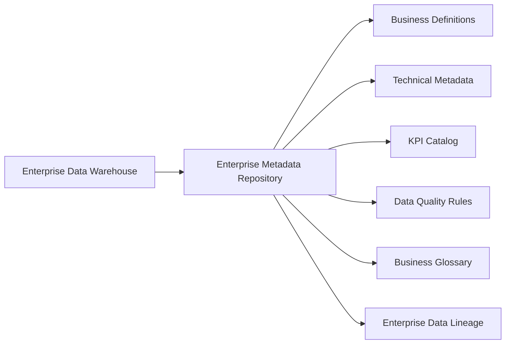

# Enterprise Metadata Repository

**Project:** Vespera Lifestyle Analytics Platform  
**Sprint:** 2 – Enterprise Architecture  
**Document Version:** 1.3  
**Status:** Approved  

> **v1.2 change note:** Removed the Store Dimension (§3.3) and Promotion Dimension (§3.6) — merged into the Warehouse Dimension and dropped respectively, since no separate store master data or promotions source exists in the raw layer. Removed the Manufacturing Fact (§4.4) for the same reason. Warehouse Dimension columns renamed to match actual source fields (`facility_code`/`facility_type` → `warehouse_code`/`warehouse_type`). Sections renumbered accordingly. See `03_star_schema.md` v1.2 and `04_physical_erd.md` v2.1.

> **v1.3 change note:** Full reconciliation against the actual dbt implementation. `dim_customer` and `dim_product` corrected from Type 2 to **Type 1** and their field lists rewritten to match what's actually generated (`dim_product` previously described an apparel-specific schema — color/size/season/collection — that was never part of this dataset). `fact_inventory_daily` (§4.3) rebuilt from scratch to reflect its actual derived measures (`units_sold_qty`/`units_returned_qty`/`units_received_qty`) instead of the never-implemented `quantity_allocated`/`quantity_in_transit`/`inventory_valuation_amount`. `fact_purchase_orders` (§4.2) gained the missing `purchase_price_variance_amount` measure and dropped the nonexistent `po_line_number`. `fact_returns` (§4.4) `refunded_amount`/`restocking_fee_amount` now explicitly marked as derived, not raw-sourced. §6 rewritten to honestly mark which of the 11 original data quality rules are actually implemented vs. aspirational. §8 lineage diagram corrected to reflect the real Python → BigQuery → dbt pipeline rather than the originally-envisioned Shopify/NetSuite/Klaviyo source systems. §9 milestone table updated with the three engineering docs and correct file paths.

---

# 1. Purpose

The **Enterprise Metadata Repository** serves as the central source of truth for business, technical, and governance metadata across the Vespera Lifestyle Analytics Platform.

As the final architectural artifact of Sprint 2, this repository complements the previous Enterprise Data Model, Logical Data Model, Star Schema, and Physical ERD by documenting the meaning, ownership, quality, lineage, and governance of every analytical asset within the Enterprise Data Warehouse.

This repository establishes:

- Business definitions for enterprise data assets
- Technical metadata and field specifications
- Enterprise governance standards
- KPI definitions and calculation logic
- Data quality assertions
- Business glossary
- Enterprise data lineage
- Metadata ownership and stewardship

Together these provide a common language for Analytics Engineering, Business Intelligence, Data Science, Finance, Supply Chain, Marketing, and Executive stakeholders.

---

# 2. Repository Architecture

The Enterprise Metadata Repository documents every analytical asset from the business definition through technical implementation and governance.

---

## 2.1 Metadata Standards & Governance Matrix

Every cataloged asset within the Vespera data ecosystem adheres to standardized enterprise metadata requirements.

| Metadata Property | Description & Enterprise Standard |
| :--- | :--- |
| **Business Definition** | Plain-language definition agreed upon by business stakeholders. |
| **Technical Definition** | Physical data type, nullability, primary/foreign keys, and implementation details. |
| **Data Classification** | Enterprise security classification (`Public`, `Internal`, `Confidential`, `Restricted / PII`). |
| **Business Owner** | Department responsible for business meaning and KPI interpretation. |
| **Technical Steward** | Analytics Engineering team responsible for schema management and pipeline reliability. |
| **Source System** | Upstream operational application where the data originates. |
| **Transformation Logic** | Business rules implemented within dbt transformations. |
| **Refresh Frequency** | Target SLA for data availability within the warehouse. |

---

## 2.2 Metadata Coverage Matrix

The repository provides complete metadata coverage across all major analytical domains.

| Enterprise Domain | Business Metadata | Technical Metadata | KPI Catalog | Data Lineage | Data Quality |
| :--- | :---: | :---: | :---: | :---: | :---: |
| Customer | ✓ | ✓ | ✓ | ✓ | ✓ |
| Product | ✓ | ✓ | ✓ | ✓ | ✓ |
| Sales | ✓ | ✓ | ✓ | ✓ | ✓ |
| Inventory | ✓ | ✓ | ✓ | ✓ | ✓ |
| Procurement | ✓ | ✓ | ✓ | ✓ | ✓ |

---

## 2.3 Enterprise Data Classification Levels

| Classification | Description |
| :--- | :--- |
| **Public** | Information approved for external publication or customer-facing documentation. |
| **Internal** | Operational information intended for internal company use only. |
| **Confidential** | Sensitive commercial information requiring controlled employee access. |
| **Restricted / PII** | Personally Identifiable Information requiring masking, encryption, and restricted access. |

---

# 3. Enterprise Dimensions (`vespera_dw.dim_*`)

## 3.1 Customer Dimension (`dim_customer`)

**Business Owner:** Head of CRM & Loyalty  
**Technical Steward:** Analytics Engineering  
**Source System:** Customer Master Data  
**Refresh Frequency:** Batch (on generation/reload)  
**SCD Strategy:** Type 1 (current-state only — see `03_star_schema.md` §4 for why Type 2 is deferred, not omitted by oversight)

| Column Name | Physical Type | Null | Key | Classification | Source Field | Transformation Rule | Business Definition & Validation |
| :--- | :--- | :---: | :---: | :--- | :--- | :--- | :--- |
| `customer_key` | `INT64` | No | PK | Internal | N/A | `FARM_FINGERPRINT(customer_id)` | Surrogate key identifying a customer record. |
| `customer_id` | `STRING` | No | NK | Internal | Customer Master | `TRIM(customer_id)` | Natural customer identifier. Pattern: `CUST-[0-9]+`. |
| `first_name` | `STRING` | Yes | - | Restricted / PII | Customer Master | `TRIM(first_name)` | Customer given name. |
| `last_name` | `STRING` | Yes | - | Restricted / PII | Customer Master | `TRIM(last_name)` | Customer family name. |
| `email_address` | `STRING` | Yes | - | Restricted / PII | Customer Master | `LOWER(TRIM(email))` | Primary customer email address. |
| `phone_number` | `STRING` | Yes | - | Restricted / PII | Customer Master | Direct Mapping | Customer phone number. |
| `customer_country` | `STRING` | No | - | Public | Customer Master | Direct Mapping | Customer's country. |
| `gender` | `STRING` | Yes | - | Restricted / PII | Customer Master | Direct Mapping | Self-reported gender. |
| `birth_date` | `DATE` | Yes | - | Restricted / PII | Customer Master | Direct Mapping | Date of birth. |
| `customer_since` | `DATE` | No | - | Internal | Customer Master | Direct Mapping | Account signup date. |
| `loyalty_tier` | `STRING` | No | - | Internal | Customer Master | Direct Mapping | Bronze, Silver, Gold, or Platinum. |
| `acquisition_channel` | `STRING` | Yes | - | Internal | Customer Master | Direct Mapping | Original acquisition source for the customer. |
| `customer_status` | `STRING` | No | - | Internal | Customer Master | Direct Mapping | Account status. |

---

## 3.2 Product Dimension (`dim_product`)

**Business Owner:** VP of Merchandising  
**Technical Steward:** Analytics Engineering  
**Source System:** Product Master Data  
**Refresh Frequency:** Batch (on generation/reload)  
**SCD Strategy:** Type 1 (current-state only — see `03_star_schema.md` §4)

| Column Name | Physical Type | Null | Key | Classification | Source Field | Transformation Rule | Business Definition & Validation |
| :--- | :--- | :---: | :---: | :--- | :--- | :--- | :--- |
| `product_key` | `INT64` | No | PK | Internal | N/A | `FARM_FINGERPRINT(product_id)` | Surrogate key identifying a product record. |
| `product_id` | `STRING` | No | NK | Internal | Product Master | `TRIM(product_id)` | Natural product identifier. |
| `sku_code` | `STRING` | No | NK | Internal | Product Master | `TRIM(sku)` | Unique Stock Keeping Unit identifier. |
| `product_name` | `STRING` | No | - | Public | Product Master | `TRIM(product_name)` | Commercial product name. |
| `category_name` | `STRING` | No | - | Public | Product Master | Direct Mapping | Top-level merchandise category (Personal Care, Apparel, Accessories, Home & Living). |
| `brand_name` | `STRING` | No | - | Public | Product Master | Direct Mapping | Product brand. |
| `base_cost_sgd` | `NUMERIC(10,2)` | No | - | Restricted | Product Master | Direct Mapping | Standard product cost in SGD. |
| `msrp_sgd` | `NUMERIC(10,2)` | No | - | Confidential | Product Master | Direct Mapping | Manufacturer Suggested Retail Price in SGD. |
| `launch_date` | `DATE` | No | - | Internal | Product Master | Direct Mapping | Date the product became sellable. |
| `lifecycle_status` | `STRING` | No | - | Internal | Product Master | Direct Mapping | New Launch, Active, or Discontinued. |
| `discontinued_date` | `DATE` | Yes | - | Internal | Product Master | Direct Mapping | Date the product was discontinued, if applicable. |
| `popularity_weight` | `FLOAT64` | No | - | Internal | Product Master | Direct Mapping | Pareto-distributed demand-skew weight; drives realistic 80/20 sales concentration in downstream sampling. |
| `return_rate` | `FLOAT64` | No | - | Internal | Product Master | Direct Mapping | Category-level expected return rate. |
| `is_currently_sellable` | `BOOL` | No | - | Internal | dbt | `NOT discontinued AND launched` | Derived flag — false if discontinued or not yet launched as of today. |

---

## 3.3 Supplier Dimension (`dim_supplier`)

**Business Owner:** Director of Procurement  
**Technical Steward:** Analytics Engineering  
**Source System:** Supplier Master Data  
**Refresh Frequency:** Batch (on generation/reload)  
**SCD Strategy:** Type 1

| Column Name | Physical Type | Null | Key | Classification | Source Field | Transformation Rule | Business Definition & Validation |
| :--- | :--- | :---: | :---: | :--- | :--- | :--- | :--- |
| `supplier_key` | `INT64` | No | PK | Internal | N/A | `FARM_FINGERPRINT(supplier_id)` | Supplier surrogate key. |
| `supplier_id` | `STRING` | No | NK | Internal | Supplier Master | `TRIM(supplier_id)` | Business supplier identifier. |
| `supplier_name` | `STRING` | No | - | Internal | Supplier Master | `TRIM(supplier_name)` | Supplier name. |
| `supplier_tier` | `STRING` | No | - | Internal | Supplier Master | Direct Mapping | Strategic, Preferred, or Standard. |
| `category_specialty` | `STRING` | No | - | Internal | Supplier Master | Direct Mapping | Product category this supplier specializes in. |
| `supplier_country` | `STRING` | No | - | Public | Supplier Master | Direct Mapping | Supplier country. |
| `supplier_currency` | `STRING` | No | - | Internal | Supplier Master | Direct Mapping | Supplier's invoicing currency. |
| `payment_terms` | `STRING` | Yes | - | Internal | Supplier Master | Direct Mapping | Payment agreement terms. |
| `lead_time_days` | `INT64` | No | - | Internal | Supplier Master | Direct Mapping | Standard fulfillment lead time. |
| `quality_rating` | `FLOAT64` | Yes | - | Internal | Supplier Master | Direct Mapping | Supplier quality score. |
| `preferred_supplier` | `BOOL` | No | - | Internal | Supplier Master | Direct Mapping | Preferred-vendor flag, correlated with tier. |

---

## 3.4 Warehouse Dimension (`dim_warehouse`)

**Business Owner:** Director of Supply Chain  
**Technical Steward:** Analytics Engineering  
**Source System:** Warehouse Master Data  
**Refresh Frequency:** Batch (on generation/reload)  
**SCD Strategy:** Type 1

Single conformed dimension covering Distribution Centers, Retail Stores, and the Returns Center — Vespera has one physical/fulfillment location entity, not a separate store master. `warehouse_type` distinguishes the three facility roles.

| Column Name | Physical Type | Null | Key | Classification | Source Field | Transformation Rule | Business Definition & Validation |
| :--- | :--- | :---: | :---: | :--- | :--- | :--- | :--- |
| `warehouse_key` | `INT64` | No | PK | Internal | N/A | `FARM_FINGERPRINT(warehouse_id)` | Warehouse surrogate key. |
| `warehouse_id` | `STRING` | No | NK | Internal | Warehouse Master | `TRIM(warehouse_id)` | Natural warehouse identifier. |
| `warehouse_code` | `STRING` | No | NK | Internal | Warehouse Master | `UPPER(TRIM(warehouse_code))` | Business warehouse identifier. |
| `warehouse_name` | `STRING` | No | - | Public | Warehouse Master | `TRIM(warehouse_name)` | Warehouse display name. |
| `warehouse_type` | `STRING` | No | - | Public | Warehouse Master | Direct Mapping | Distribution Center, Retail Store, or Returns Center. |
| `warehouse_country` | `STRING` | No | - | Public | Warehouse Master | ISO-3166 Standard | Country location. |
| `warehouse_city` | `STRING` | Yes | - | Public | Warehouse Master | `TRIM(city)` | City location. |
| `warehouse_region` | `STRING` | Yes | - | Internal | Warehouse Master | Direct Mapping | Sales/fulfillment region. |
| `serves_countries` | `STRING` | No | - | Internal | Warehouse Master | Direct Mapping | Countries this facility is eligible to fulfill orders for. Retail Stores serve only their own country; Distribution Centers serve a regional cluster. |

---

## 3.5 Date Dimension (`dim_date`)

**Business Owner:** Enterprise Analytics  
**Technical Steward:** Analytics Engineering  
**Source System:** Generated Calendar Table  
**Refresh Frequency:** Static (Generated Once)  
**SCD Strategy:** Static

| Column Name | Physical Type | Null | Key | Classification | Source Field | Transformation Rule | Business Definition & Validation |
| :--- | :--- | :---: | :---: | :--- | :--- | :--- | :--- |
| `date_key` | `INT64` | No | PK | Public | Calendar Generator | `FORMAT_DATE('%Y%m%d', full_date)` | Integer date surrogate key. |
| `full_date` | `DATE` | No | NK | Public | Calendar Generator | Generated | Calendar date. |
| `day_of_week_number` | `INT64` | No | - | Public | Calendar Generator | Generated | ISO day of week. |
| `day_name` | `STRING` | No | - | Public | Calendar Generator | Generated | Monday, Tuesday, etc. |
| `is_weekend_flag` | `BOOL` | No | - | Public | Calendar Generator | Generated | True for Saturday/Sunday. |
| `week_number` | `INT64` | No | - | Public | Calendar Generator | Generated | ISO week number. |
| `calendar_month_number` | `INT64` | No | - | Public | Calendar Generator | Generated | Calendar month. |
| `month_name` | `STRING` | No | - | Public | Calendar Generator | Generated | Month name. |
| `calendar_quarter_number` | `INT64` | No | - | Public | Calendar Generator | Generated | Calendar quarter. |
| `calendar_year_number` | `INT64` | No | - | Public | Calendar Generator | Generated | Calendar year. |
| `fiscal_year_number` | `INT64` | No | - | Internal | Calendar Generator | Generated | Fiscal year — assumed = calendar year, no evidence of a non-calendar fiscal year anywhere in source docs. |
| `fiscal_quarter_number` | `INT64` | No | - | Internal | Calendar Generator | Generated | Fiscal quarter (= calendar quarter). |
| `fiscal_month_number` | `INT64` | No | - | Internal | Calendar Generator | Generated | Fiscal month (= calendar month). |
| `holiday_flag` | `BOOL` | No | - | Public | Calendar Generator | Generated | Simplified heuristic (New Year's, Christmas, and SEA e-commerce flash-sale dates 9/9, 10/10, 11/11, 12/12) — not a real per-country public holiday calendar. |

---

# 4. Enterprise Facts (`vespera_dw.fact_*`)

Fact tables capture measurable business events at their declared grain. Each fact references conformed dimensions using surrogate keys and stores additive, semi-additive, or non-additive business measures for enterprise reporting.

---

## 4.1 Sales Transactions Fact (`fact_sales`)

**Business Owner:** VP of Retail & E-Commerce  
**Technical Steward:** Analytics Engineering  
**Source System:** Order Management  
**Grain:** One record per order line item  
**Refresh Frequency:** Batch (on generation/reload)

| Column Name | Physical Type | Null | Key | Classification | Source Field | Transformation Rule | Business Definition & Validation |
| :--- | :--- | :---: | :---: | :--- | :--- | :--- | :--- |
| `sales_fact_key` | `INT64` | No | PK | Internal | N/A | `FARM_FINGERPRINT(order_item_id)` | Unique surrogate key for each sales line. |
| `order_date_key` | `INT64` | No | FK | Internal | `order_date` | Date Lookup | Foreign key to `dim_date`. |
| `customer_key` | `INT64` | No | FK | Restricted | Customer Lookup | Lookup, `COALESCE(..., -1)` | Customer dimension reference. |
| `product_key` | `INT64` | No | FK | Internal | SKU | Lookup, `COALESCE(..., -1)` | Product sold. |
| `warehouse_key` | `INT64` | No | FK | Internal | Warehouse ID | Lookup, `COALESCE(..., -1)` | Fulfilling warehouse reference. |
| `order_number` | `STRING` | No | DD | Internal | Order Header | Direct Mapping | Business order identifier. |
| `line_item_number` | `INT64` | No | DD | Internal | dbt | `ROW_NUMBER() OVER (PARTITION BY order_id ORDER BY order_item_id)` | Line number within order. |
| `sales_channel_code` | `STRING` | No | DD | Internal | Order Header | Direct Mapping | Shopify, Shopee, Lazada, or Retail. Order-level attribute, independent of the fulfilling warehouse. |
| `payment_method` | `STRING` | Yes | DD | Confidential | Order Header | Direct Mapping | Payment method used. |
| `fulfillment_status` | `STRING` | Yes | DD | Internal | Order Header | Direct Mapping | Fulfillment lifecycle status. |
| `quantity_ordered` | `INT64` | No | - | Internal | Order Line | Direct Mapping | Units sold. |
| `unit_list_price_amount` | `NUMERIC(10,2)` | No | - | Confidential | Product Master | `dim_product.msrp_sgd` | MSRP before discounts. |
| `unit_selling_price_amount` | `NUMERIC(10,2)` | No | - | Confidential | Order Line | Direct Mapping | Actual selling price. |
| `gross_revenue_amount` | `NUMERIC(12,2)` | No | - | Confidential | Order Line | `quantity × selling_price` | Gross revenue. |
| `discount_amount` | `NUMERIC(12,2)` | No | - | Confidential | Order Line | Direct Mapping | Discount amount. |
| `tax_amount` | `NUMERIC(12,2)` | No | - | Internal | Order Line | Direct Mapping | Sales tax collected (flat rate by warehouse country). |
| `net_revenue_amount` | `NUMERIC(12,2)` | No | - | Confidential | Order Line | `gross − discount` | Net revenue. |
| `commission_amount` | `NUMERIC(12,2)` | No | - | Confidential | Order Line | Direct Mapping | Channel commission (Shopee 6%, Lazada 5%, Shopify/Retail 0%). |
| `cogs_amount` | `NUMERIC(12,2)` | No | - | Restricted | Calculated | `quantity × dim_product.base_cost_sgd` | Cost of goods sold, at the product's **current** cost (Type 1 dimension — not cost-as-of-order-date). |

---

## 4.2 Purchase Orders Fact (`fact_purchase_orders`)

**Business Owner:** Director of Procurement  
**Technical Steward:** Analytics Engineering  
**Source System:** Procurement System  
**Grain:** One record per purchase order (each raw source row is already atomic — no separate PO-header-vs-line split in this source)  
**Refresh Frequency:** Batch (on generation/reload)

| Column Name | Physical Type | Null | Key | Classification | Source Field | Transformation Rule | Business Definition & Validation |
| :--- | :--- | :---: | :---: | :--- | :--- | :--- | :--- |
| `purchase_order_fact_key` | `INT64` | No | PK | Internal | N/A | `FARM_FINGERPRINT(purchase_order_id)` | Purchase order surrogate key. |
| `po_date_key` | `INT64` | No | FK | Internal | Procurement | Date Lookup | Purchase order date. |
| `expected_delivery_date_key` | `INT64` | Yes | FK | Internal | Procurement | Date Lookup | Expected arrival date. |
| `supplier_key` | `INT64` | No | FK | Internal | Vendor | Lookup, `COALESCE(..., -1)` | Supplier reference. |
| `product_key` | `INT64` | No | FK | Internal | SKU | Lookup, `COALESCE(..., -1)` | Purchased SKU. |
| `destination_warehouse_key` | `INT64` | No | FK | Internal | Warehouse | Lookup, `COALESCE(..., -1)` | Receiving warehouse. |
| `po_number` | `STRING` | No | DD | Internal | Procurement | Direct Mapping | Purchase Order Number. |
| `po_status_code` | `STRING` | No | DD | Internal | Procurement | Direct Mapping | Received or In Transit. |
| `demand_tier` | `STRING` | No | DD | Internal | Procurement | Direct Mapping | Low, Medium, High, or Very High — percentile-rank bucket of the product's `popularity_weight`. |
| `ordered_quantity` | `INT64` | No | - | Internal | Procurement | Direct Mapping | Quantity ordered. |
| `received_quantity` | `INT64` | Yes | - | Internal | Procurement | Direct Mapping | Quantity received (0 if still In Transit). |
| `unit_purchase_cost_amount` | `NUMERIC(10,2)` | No | - | Confidential | Procurement | Direct Mapping | Unit purchase cost. |
| `total_purchase_cost_amount` | `NUMERIC(12,2)` | No | - | Confidential | Calculated | Qty × Cost | Total purchase value. |
| `lead_time_days` | `INT64` | Yes | - | Internal | Calculated | Date Difference | Procurement lead time. |
| `purchase_price_variance_amount` | `NUMERIC(12,2)` | Yes | - | Restricted | Calculated | `(unit_purchase_cost_amount − dim_product.base_cost_sgd) × ordered_quantity` | Actual cost paid vs. the product's **current** standard cost (Type 1 dimension caveat — same as `fact_sales.cogs_amount`). |

---

## 4.3 Inventory Daily Fact (`fact_inventory_daily`)

**Business Owner:** Director of Supply Chain  
**Technical Steward:** Analytics Engineering  
**Source System:** Derived — see Transformation Logic  
**Grain:** One record per SKU per warehouse per calendar day  
**Refresh Frequency:** Batch (on generation/reload)

> **This is a derived fact, not a direct source mirror.** `raw_inventory_snapshot` is a single point-in-time reading per (warehouse, product) — not a daily series. `quantity_on_hand` is reconstructed via a calibrated running total of the signed movement ledger (`raw_inventory_movements`), anchored to the one known snapshot value, then forward-filled across days with no movement. Full methodology and manual verification against ground truth in `docs/03_engineering/02_dbt_transformation_spec.md` §5 and §7.

| Column Name | Physical Type | Null | Key | Classification | Source Field | Transformation Rule | Business Definition & Validation |
| :--- | :--- | :---: | :---: | :--- | :--- | :--- | :--- |
| `inventory_fact_key` | `INT64` | No | PK | Internal | N/A | `FARM_FINGERPRINT(warehouse_id \|\| product_id \|\| balance_date)` | Snapshot surrogate key. |
| `snapshot_date_key` | `INT64` | No | FK | Internal | Calendar | Date Lookup | Balance date. |
| `product_key` | `INT64` | No | FK | Internal | SKU | Lookup, `COALESCE(..., -1)` | Product reference. |
| `warehouse_key` | `INT64` | No | FK | Internal | Warehouse | Lookup, `COALESCE(..., -1)` | Warehouse reference. |
| `quantity_on_hand` | `INT64` | No | - | Confidential | **Derived** — see note above | Calibrated running ledger balance, forward-filled | End-of-day on-hand quantity. Small negative values on a handful of (warehouse, product) pairs are expected, accepted stockout noise — see `00_data_generation_assumptions.md`. |
| `units_sold_qty` | `INT64` | No | - | Internal | `raw_inventory_movements` | Same-day sum of `CUSTOMER_SALE` movements | Units sold that day. |
| `units_returned_qty` | `INT64` | No | - | Internal | `raw_inventory_movements` | Same-day sum of `CUSTOMER_RETURN` movements | Units returned that day. |
| `units_received_qty` | `INT64` | No | - | Internal | `raw_inventory_movements` | Same-day sum of `INBOUND_PURCHASE` movements | Units received from suppliers that day. |

> **`quantity_allocated`, `quantity_in_transit`, `unit_cost_amount`, and `inventory_valuation_amount` are deliberately NOT included.** An earlier version of this spec listed them, but they only exist in `raw_inventory_snapshot` as a single point-in-time reading, not a real daily-varying series — fabricating a daily trend for them would be actively misleading. Requires new raw source data (e.g. a real WMS feed) to add properly, not a derivation from what exists today.

---

## 4.4 Returns Fact (`fact_returns`)

**Business Owner:** Director of Customer Experience  
**Technical Steward:** Analytics Engineering  
**Source System:** Returns Processing (`refunded_amount`/`restocking_fee_amount` are derived — see below)  
**Grain:** One record per returned order line item  
**Refresh Frequency:** Batch (on generation/reload)

| Column Name | Physical Type | Null | Key | Classification | Source Field | Transformation Rule | Business Definition & Validation |
| :--- | :--- | :---: | :---: | :--- | :--- | :--- | :--- |
| `return_fact_key` | `INT64` | No | PK | Internal | N/A | `FARM_FINGERPRINT(return_id)` | Return surrogate key. |
| `return_date_key` | `INT64` | No | FK | Internal | Returns | Date Lookup | Return transaction date. |
| `original_order_date_key` | `INT64` | No | FK | Internal | Original Order | Date Lookup | Date of the order this return relates to. |
| `customer_key` | `INT64` | No | FK | Restricted | Original Order | Lookup, `COALESCE(..., -1)` | Customer reference (via the original order — `raw_returns` doesn't carry `customer_id` directly). |
| `product_key` | `INT64` | No | FK | Internal | SKU | Lookup, `COALESCE(..., -1)` | Returned product. |
| `warehouse_key` | `INT64` | No | FK | Internal | Warehouse | Lookup, `COALESCE(..., -1)` | Receiving warehouse. |
| `return_authorization_number` | `STRING` | No | DD | Internal | Returns | Direct Mapping | Business return identifier. |
| `disposition_code` | `STRING` | No | DD | Internal | Returns | Direct Mapping | Restock, Refurbish, Liquidate, or Dispose. |
| `return_reason_code` | `STRING` | No | DD | Internal | Returns | Direct Mapping | Customer-stated return reason. |
| `returned_quantity` | `INT64` | No | - | Internal | Returns | Direct Mapping | Quantity returned. |
| `refunded_amount` | `NUMERIC(12,2)` | No | - | Confidential | **Derived, not a raw column** | `returned_quantity × (original order item's net_sales / quantity)` | Refund value, prorated from the original line item's actual net unit price. `raw_returns` has no refund-amount column — confirmed absent via `INFORMATION_SCHEMA.COLUMNS`. |
| `restocking_fee_amount` | `NUMERIC(12,2)` | No | - | Confidential | **Derived, not a raw column** | `10% of refunded_amount, only when return_reason_code = 'Customer Remorse'` | Applied restocking fee, per the business rule in `00_data_generation_assumptions.md`. Not a raw source column. |

---

# 5. Enterprise KPI & Metric Catalog ⭐

The following KPIs are standardized enterprise metrics used across executive dashboards, operational reporting, and self-service analytics.

| Metric Name | Formula / SQL Logic | Business Owner | Aggregation Type | Standard Grain | Refresh SLA |
| :--- | :--- | :--- | :--- | :--- | :--- |
| **Gross Revenue** | `SUM(gross_revenue_amount)` | Finance | Fully Additive | Order Line | Batch |
| **Net Revenue** | `SUM(net_revenue_amount)` | Finance | Fully Additive | Order Line | Batch |
| **Average Order Value (AOV)** | `SUM(net_revenue_amount) / COUNT(DISTINCT order_number)` | E-Commerce | Non-Additive | Daily / Channel | Batch |
| **Gross Profit Margin %** | `(SUM(net_revenue_amount) - SUM(cogs_amount)) / SUM(net_revenue_amount)` | Finance | Non-Additive | SKU / Month | Batch |
| **Inventory Sell-Through Rate** | `SUM(quantity_ordered) / (SUM(quantity_ordered) + AVG(quantity_on_hand))` | Merchandise | Semi-Additive | SKU / Month | Batch |
| **Customer Retention Rate (90d)** | `COUNT(DISTINCT active_repeat_cust) / COUNT(DISTINCT cohort_cust)` | Growth / CRM | Non-Additive | Monthly Cohort | Batch |

> **Not yet built as dbt models.** These are target KPI definitions for the Looker Studio phase — none currently exist as materialized dbt marts or Looker Studio calculated fields. Listed here to establish the standard formula ahead of dashboard build, per `docs/01_business/05_enterprise_kpi_framework.md`.

---

# 6. Enterprise Data Quality Rules & Assertions ⭐

The Vespera data platform enforces automated data quality validation using **dbt's built-in generic tests** (`unique`, `not_null`, `accepted_values`, `relationships`). `dbt-expectations` is **not** currently a project dependency — the rules below marked ❌ are not yet implemented. Full inventory of what's actually implemented, including a real case study of what these tests did and didn't catch, is in `docs/03_engineering/03_data_quality_framework.md`.

## Entity Integrity

1. **Surrogate Key Uniqueness** ✅ Implemented
   Primary keys across `dim_customer`, `dim_product`, `dim_supplier`, and `dim_warehouse` must be unique (`COUNT(sk) = COUNT(DISTINCT sk)`).

2. **Natural Key Uniqueness** ✅ Implemented
   Active business keys (`customer_id`, `product_id`, `sku_code`, `warehouse_id`, `supplier_id`) must never contain duplicates.

3. **Single Active SCD Record** — N/A
   No SCD Type 2 dimensions currently exist (all dimensions are Type 1 — see `03_star_schema.md` §4), so there's no "active version" concept to test yet.

---

## Referential Integrity

4. **Fact-to-Dimension Relationships** ✅ Implemented
   Every foreign key in every fact table must resolve to an existing dimension record.

5. **Unknown Member Handling** ✅ Implemented
   Missing dimension references default to surrogate key `-1` via `COALESCE()` in every fact-building model, instead of creating orphan records or dropping rows.

---

## Financial Validation

6. **Non-Negative Financial Values** ❌ Not implemented as a dbt test
   Revenue, cost, tax, and discount fields should be ≥ 0.

7. **Discount Validation** ❌ Not implemented as a dbt test
   `discount_amount <= gross_revenue_amount`

8. **Net Revenue Validation** ❌ Not implemented as a dbt test
   `gross_revenue_amount − discount_amount = net_revenue_amount`

---

## Inventory Validation

9. **Inventory Cannot Be Negative** ❌ Not implemented as a blanket test
   `quantity_on_hand >= 0`, **except** `fact_inventory_daily` contains a small number of genuine negative balances by design (documented, accepted stockout noise — see `00_data_generation_assumptions.md`). This rule needs a real exception clause before it can be safely enabled, not just a blanket assertion.

10. **Purchase Order Validation** ❌ Not implemented as a dbt test
    `received_quantity <= ordered_quantity`

---

## Timestamp Validation

11. **No Future Dates** ❌ Not implemented — and not very meaningful for a static historical simulation with a fixed 2024-2025 date range, versus a live incrementally-loading pipeline.

---

# 7. Business Glossary ⭐

| Business Term | Definition |
| :--- | :--- |
| **Order** | A commercial transaction between a customer and Vespera. |
| **SKU (Stock Keeping Unit)** | Lowest sellable inventory unit — one unique product. |
| **Inventory Snapshot** | The single point-in-time inventory reading captured in `raw_inventory_snapshot`, distinct from `fact_inventory_daily`'s derived daily series. |
| **Net Revenue** | Gross Revenue minus discounts (excluding taxes). |
| **Gross Margin** | Net Revenue minus Cost of Goods Sold (COGS). |
| **Conformed Dimension** | A shared dimension reused across multiple fact tables to ensure enterprise-wide reporting consistency. |
| **SCD Type 1** | Slowly Changing Dimension methodology that overwrites attribute changes in place, keeping no history. Currently used for all five dimensions in this warehouse. |
| **SCD Type 2** | Slowly Changing Dimension methodology that preserves historical attribute changes through versioned records. Not yet used anywhere in this warehouse — see `03_star_schema.md` §4. |
| **Demand Tier** | Low/Medium/High/Very High bucket assigned by percentile rank of a product's `popularity_weight`, used to scale purchase order quantity and reorder cadence. |

---

# 8. Enterprise Data Lineage ⭐

The following diagram illustrates the actual end-to-end data flow, from the Python simulation engine through ingestion, transformation, warehousing, and (planned) business intelligence.

---

# 9. Architectural Milestones ⭐

The following documents collectively define the complete enterprise analytics architecture.

| Artifact | Status | Repository Path |
| :--- | :---: | :--- |
| ✅ **01 Enterprise Data Model** | Complete | `docs/02_architecture/01_enterprise_data_model.md` |
| ✅ **02 Logical Data Model** | Complete | `docs/02_architecture/02_logical_data_model.md` |
| ✅ **03 Star Schema Specification** | Complete | `docs/02_architecture/03_star_schema.md` |
| ✅ **04 Physical ERD & DDL** | Complete | `docs/02_architecture/04_physical_erd.md` |
| ✅ **05 Enterprise Data Dictionary & Metadata Repository** | Complete | `docs/02_architecture/05_data_dictionary.md` |
| ✅ **ETL Design** | Complete (Extract/Load/Transform) | `docs/03_engineering/01_etl_design.md` |
| ✅ **dbt Transformation Spec** | Complete | `docs/03_engineering/02_dbt_transformation_spec.md` |
| ✅ **Data Quality Framework** | Complete | `docs/03_engineering/03_data_quality_framework.md` |
| ⏳ **Looker Studio Dashboards** | Next | — |

---

# Architecture & Engineering: Complete ✅

The Vespera Analytics Platform now includes a fully specified, fully implemented, and fully tested data platform from raw generation through the dimensional mart layer:

- Enterprise Data Model, Logical Data Model, Star Schema, Physical ERD, and this Metadata Repository — all reconciled against the actual implementation
- 13 raw tables, 13 dbt staging models, 3 intermediate models, 5 dimensions, and 4 fact tables — all built and passing 91 dbt tests
- A documented, real data-quality case study (`03_engineering/01_etl_design.md` §7 and `03_engineering/03_data_quality_framework.md` §6)

Looker Studio dashboard design is the next and final phase.