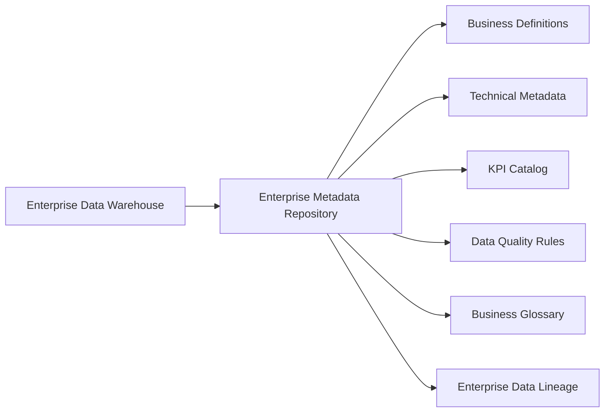
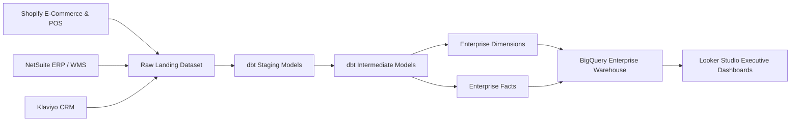

# Enterprise Metadata Repository

**Project:** Vespera Lifestyle Analytics Platform  
**Sprint:** 2 – Enterprise Architecture  
**Document Version:** 1.2  
**Status:** Approved  

> **v1.2 change note:** Removed the Store Dimension (§3.3) and Promotion Dimension (§3.6) — merged into the Warehouse Dimension and dropped respectively, since no separate store master data or promotions source exists in the raw layer. Removed the Manufacturing Fact (§4.4) for the same reason. Warehouse Dimension columns renamed to match actual source fields (`facility_code`/`facility_type` → `warehouse_code`/`warehouse_type`). Sections renumbered accordingly. See `03_star_schema.md` v1.2 and `04_physical_erd.md` v2.1.

---

# 1. Purpose

The **Enterprise Metadata Repository** serves as the central source of truth for business, technical, and governance metadata across the Vespera Lifestyle Analytics Platform.

As the final architectural artifact of Sprint 2, this repository complements the previous Enterprise Data Model, Logical Data Model, Star Schema, and Physical ERD by documenting the meaning, ownership, quality, lineage, and governance of every analytical asset within the Enterprise Data Warehouse.

This repository establishes:

- Business definitions for enterprise data assets
- Technical metadata and field specifications
- Enterprise governance standards
- KPI definitions and calculation logic
- Data quality assertions
- Business glossary
- Enterprise data lineage
- Metadata ownership and stewardship

Together these provide a common language for Analytics Engineering, Business Intelligence, Data Science, Finance, Supply Chain, Marketing, and Executive stakeholders.

---

# 2. Repository Architecture

The Enterprise Metadata Repository documents every analytical asset from the business definition through technical implementation and governance.



---

## 2.1 Metadata Standards & Governance Matrix

Every cataloged asset within the Vespera data ecosystem adheres to standardized enterprise metadata requirements.

| Metadata Property | Description & Enterprise Standard |
| :--- | :--- |
| **Business Definition** | Plain-language definition agreed upon by business stakeholders. |
| **Technical Definition** | Physical data type, nullability, primary/foreign keys, and implementation details. |
| **Data Classification** | Enterprise security classification (`Public`, `Internal`, `Confidential`, `Restricted / PII`). |
| **Business Owner** | Department responsible for business meaning and KPI interpretation. |
| **Technical Steward** | Analytics Engineering team responsible for schema management and pipeline reliability. |
| **Source System** | Upstream operational application where the data originates. |
| **Transformation Logic** | Business rules implemented within dbt transformations. |
| **Refresh Frequency** | Target SLA for data availability within the warehouse. |

---

## 2.2 Metadata Coverage Matrix

The repository provides complete metadata coverage across all major analytical domains.

| Enterprise Domain | Business Metadata | Technical Metadata | KPI Catalog | Data Lineage | Data Quality |
| :--- | :---: | :---: | :---: | :---: | :---: |
| Customer | ✓ | ✓ | ✓ | ✓ | ✓ |
| Product | ✓ | ✓ | ✓ | ✓ | ✓ |
| Sales | ✓ | ✓ | ✓ | ✓ | ✓ |
| Inventory | ✓ | ✓ | ✓ | ✓ | ✓ |
| Procurement | ✓ | ✓ | ✓ | ✓ | ✓ |
| Manufacturing | ✓ | ✓ | ✓ | ✓ | ✓ |

---

## 2.3 Enterprise Data Classification Levels

| Classification | Description |
| :--- | :--- |
| **Public** | Information approved for external publication or customer-facing documentation. |
| **Internal** | Operational information intended for internal company use only. |
| **Confidential** | Sensitive commercial information requiring controlled employee access. |
| **Restricted / PII** | Personally Identifiable Information requiring masking, encryption, and restricted access. |

---

# 3. Enterprise Dimensions (`vespera_dw_prod.dim_*`)

## 3.1 Customer Dimension (`dim_customer`)

**Business Owner:** Head of CRM & Loyalty  
**Technical Steward:** Analytics Engineering  
**Source System:** Shopify Direct / Klaviyo Marketing Platform  
**Refresh Frequency:** Near Real-Time (CDC via Fivetran)  
**SCD Strategy:** Type 2 (Historical tracking for customer profile changes)

| Column Name | Physical Type | Null | Key | Classification | Source Field | Transformation Rule | Business Definition & Validation |
| :--- | :--- | :---: | :---: | :--- | :--- | :--- | :--- |
| `customer_key` | `INT64` | No | PK | Internal | N/A | `FARM_FINGERPRINT(customer_id || CAST(dbt_valid_from AS STRING))` | Surrogate key uniquely identifying a customer dimension record over time. |
| `customer_id` | `STRING` | No | NK | Internal | `raw_shopify.customers.id` | `TRIM(CAST(id AS STRING))` | Natural customer identifier. Pattern: `CUST-[0-9]+`. |
| `first_name` | `STRING` | Yes | - | Restricted / PII | `raw_shopify.customers.first_name` | `INITCAP(TRIM(first_name))` | Customer given name. Masked in non-production environments. |
| `last_name` | `STRING` | Yes | - | Restricted / PII | `raw_shopify.customers.last_name` | `INITCAP(TRIM(last_name))` | Customer family name. Masked in non-production environments. |
| `email` | `STRING` | Yes | - | Restricted / PII | `raw_shopify.customers.email` | `LOWER(TRIM(email))` | Primary customer email address. |
| `loyalty_tier` | `STRING` | No | - | Internal | `raw_klaviyo.profiles.tier` | `COALESCE(tier,'Bronze')` | Loyalty program tier. Valid values: Bronze, Silver, Gold, Vespera Elite. |
| `acquisition_channel` | `STRING` | Yes | - | Internal | `raw_ga4.sessions.first_user_source` | Standardized marketing attribution mapping | Original acquisition source for the customer. |
| `created_at_utc` | `TIMESTAMP` | No | - | Internal | `raw_shopify.customers.created_at` | Timestamp normalization | UTC timestamp when the customer account was created. |
| `is_active` | `BOOL` | No | - | Internal | N/A | `dbt_valid_to IS NULL` | Indicates the current active SCD Type 2 version of the customer record. |

---

## 3.2 Product Dimension (`dim_product`)

**Business Owner:** VP of Merchandising  
**Technical Steward:** Analytics Engineering  
**Source System:** NetSuite ERP  
**Refresh Frequency:** Daily  
**SCD Strategy:** Type 2 (Tracks changes to merchandising attributes over time)

| Column Name | Physical Type | Null | Key | Classification | Source Field | Transformation Rule | Business Definition & Validation |
| :--- | :--- | :---: | :---: | :--- | :--- | :--- | :--- |
| `product_sk` | `INT64` | No | PK | Internal | N/A | `FARM_FINGERPRINT(sku || CAST(dbt_valid_from AS STRING))` | Surrogate key uniquely identifying a product version. |
| `sku` | `STRING` | No | NK | Internal | `raw_netsuite.items.item_id` | `UPPER(TRIM(item_id))` | Unique Stock Keeping Unit identifier. Format: `VES-[SEASON]-[CAT]-[COLOR]-[SIZE]`. |
| `product_name` | `STRING` | No | - | Public | `raw_netsuite.items.display_name` | `TRIM(display_name)` | Commercial product name. |
| `brand_name` | `STRING` | No | - | Public | `raw_netsuite.items.brand` | `TRIM(brand)` | Product brand. |
| `category_name` | `STRING` | No | - | Public | `raw_netsuite.items.category` | Category mapping | Top-level merchandise category. |
| `subcategory_name` | `STRING` | Yes | - | Public | `raw_netsuite.items.subcategory` | Subcategory mapping | Detailed merchandise classification. |
| `collection_name` | `STRING` | Yes | - | Internal | `raw_netsuite.items.collection` | `TRIM(collection)` | Collection or product line. |
| `season_code` | `STRING` | Yes | - | Internal | `raw_netsuite.items.season` | `UPPER(TRIM(season))` | Seasonal assortment identifier. |
| `color_name` | `STRING` | Yes | - | Public | `raw_netsuite.items.color` | `INITCAP(TRIM(color))` | Primary product color. |
| `size_code` | `STRING` | Yes | - | Public | `raw_netsuite.items.size` | `UPPER(TRIM(size))` | Product size code. |
| `current_msrp` | `NUMERIC(10,2)` | No | - | Confidential | `raw_netsuite.items.price` | `ROUND(CAST(price AS NUMERIC),2)` | Manufacturer Suggested Retail Price. |
| `current_base_cost` | `NUMERIC(10,2)` | No | - | Restricted | `raw_netsuite.items.cost` | `ROUND(CAST(cost AS NUMERIC),2)` | Current standard product cost. |
| `effective_start_date` | `TIMESTAMP` | No | - | Internal | dbt | SCD2 Metadata | Version effective start timestamp. |
| `effective_end_date` | `TIMESTAMP` | Yes | - | Internal | dbt | SCD2 Metadata | Version effective end timestamp. |
| `is_current_flag` | `BOOL` | No | - | Internal | dbt | `dbt_valid_to IS NULL` | Indicates active product record. |

---

## 3.3 Supplier Dimension (`dim_supplier`)

**Business Owner:** Director of Procurement  
**Technical Steward:** Analytics Engineering  
**Source System:** NetSuite ERP  
**Refresh Frequency:** Daily  
**SCD Strategy:** Type 1

| Column Name | Physical Type | Null | Key | Classification | Source Field | Transformation Rule | Business Definition & Validation |
| :--- | :--- | :---: | :---: | :--- | :--- | :--- | :--- |
| `supplier_sk` | `INT64` | No | PK | Internal | N/A | `FARM_FINGERPRINT(vendor_code)` | Supplier surrogate key. |
| `vendor_code` | `STRING` | No | NK | Internal | ERP Vendors | `UPPER(TRIM(vendor_code))` | Business supplier identifier. |
| `vendor_name` | `STRING` | No | - | Internal | ERP Vendors | `TRIM(vendor_name)` | Supplier name. |
| `country_code` | `STRING` | No | - | Public | ERP Vendors | ISO Standard | Supplier country. |
| `primary_contact_email` | `STRING` | Yes | - | Restricted | ERP Vendors | `LOWER(TRIM(email))` | Supplier contact email. |
| `quality_rating_score` | `NUMERIC(5,2)` | Yes | - | Internal | QA | Direct Mapping | Supplier quality score. |
| `payment_terms_code` | `STRING` | Yes | - | Internal | Finance | Direct Mapping | Payment agreement code. |

---

## 3.4 Warehouse Dimension (`dim_warehouse`)

**Business Owner:** Director of Supply Chain  
**Technical Steward:** Analytics Engineering  
**Source System:** Warehouse Master Data  
**Refresh Frequency:** Daily  
**SCD Strategy:** Type 1

Single conformed dimension covering Distribution Centers, Retail Stores, and the Returns Center — Vespera has one physical/fulfillment location entity, not a separate store master. `warehouse_type` distinguishes the three facility roles.

| Column Name | Physical Type | Null | Key | Classification | Source Field | Transformation Rule | Business Definition & Validation |
| :--- | :--- | :---: | :---: | :--- | :--- | :--- | :--- |
| `warehouse_sk` | `INT64` | No | PK | Internal | N/A | `FARM_FINGERPRINT(warehouse_code)` | Warehouse surrogate key. |
| `warehouse_code` | `STRING` | No | NK | Internal | Warehouse Master | `UPPER(TRIM(warehouse_code))` | Business warehouse identifier. |
| `warehouse_name` | `STRING` | No | - | Public | Warehouse Master | `TRIM(warehouse_name)` | Warehouse display name. |
| `warehouse_type` | `STRING` | No | - | Public | Warehouse Master | Direct Mapping | Distribution Center, Retail Store, or Returns Center. |
| `country_code` | `STRING` | No | - | Public | Warehouse Master | ISO-3166 Standard | Country location. |
| `city_name` | `STRING` | Yes | - | Public | Warehouse Master | `TRIM(city)` | City location. |
| `region_name` | `STRING` | Yes | - | Internal | Warehouse Master | Direct Mapping | Sales/fulfillment region. |
| `serves_countries` | `ARRAY<STRING>` | No | - | Internal | Warehouse Master | Direct Mapping | Countries this facility is eligible to fulfill orders for. Retail Stores serve only their own country; Distribution Centers serve a regional cluster. |

---

## 3.5 Date Dimension (`dim_date`)

**Business Owner:** Enterprise Analytics  
**Technical Steward:** Analytics Engineering  
**Source System:** Generated Calendar Table  
**Refresh Frequency:** Static (Generated Once)  
**SCD Strategy:** Static

| Column Name | Physical Type | Null | Key | Classification | Source Field | Transformation Rule | Business Definition & Validation |
| :--- | :--- | :---: | :---: | :--- | :--- | :--- | :--- |
| `date_key` | `INT64` | No | PK | Public | Calendar Generator | `FORMAT_DATE('%Y%m%d', full_date)` | Integer date surrogate key. |
| `full_date` | `DATE` | No | NK | Public | Calendar Generator | Generated | Calendar date. |
| `day_name` | `STRING` | No | - | Public | Calendar Generator | Generated | Monday, Tuesday, etc. |
| `week_number` | `INT64` | No | - | Public | Calendar Generator | Generated | ISO week number. |
| `calendar_month_number` | `INT64` | No | - | Public | Calendar Generator | Generated | Calendar month. |
| `month_name` | `STRING` | No | - | Public | Calendar Generator | Generated | Month name. |
| `calendar_quarter_number` | `INT64` | No | - | Public | Calendar Generator | Generated | Calendar quarter. |
| `calendar_year_number` | `INT64` | No | - | Public | Calendar Generator | Generated | Calendar year. |
| `fiscal_year_number` | `INT64` | No | - | Internal | Calendar Generator | Generated | Fiscal year. |
| `fiscal_quarter_number` | `INT64` | No | - | Internal | Calendar Generator | Generated | Fiscal quarter. |
| `holiday_flag` | `BOOL` | No | - | Public | Holiday Calendar | Generated | Indicates public holiday. |

---

# 4. Enterprise Facts (`vespera_dw_prod.fact_*`)

Fact tables capture measurable business events at their declared grain. Each fact references conformed dimensions using surrogate keys and stores additive, semi-additive, or non-additive business measures for enterprise reporting.

---

## 4.1 Sales Transactions Fact (`fact_sales`)

**Business Owner:** VP of Retail & E-Commerce  
**Technical Steward:** Analytics Engineering  
**Source System:** Shopify POS / Shopify Web Direct  
**Grain:** One record per order line item per customer transaction  
**Refresh Frequency:** Near Real-Time (15-minute micro-batches)

| Column Name | Physical Type | Null | Key | Classification | Source Field | Transformation Rule | Business Definition & Validation |
| :--- | :--- | :---: | :---: | :--- | :--- | :--- | :--- |
| `sales_fact_key` | `INT64` | No | PK | Internal | N/A | `FARM_FINGERPRINT(order_id || line_item_number)` | Unique surrogate key for each sales line. |
| `order_date_key` | `INT64` | No | FK | Internal | `created_at` | `FORMAT_TIMESTAMP('%Y%m%d', created_at)` | Foreign key to `dim_date`. |
| `customer_sk` | `INT64` | No | FK | Restricted | Customer Lookup | SCD2 Lookup | Customer dimension reference. |
| `product_sk` | `INT64` | No | FK | Internal | SKU | Product Lookup | Product sold. |
| `warehouse_sk` | `INT64` | No | FK | Internal | Warehouse ID | Warehouse Lookup | Fulfilling warehouse reference. |
| `order_number` | `STRING` | No | DD | Internal | Shopify | Direct Mapping | Business order identifier. |
| `line_item_number` | `INT64` | No | DD | Internal | Shopify | Direct Mapping | Line number within order. |
| `sales_channel_code` | `STRING` | No | DD | Internal | Order Header | Direct Mapping | Shopify, Shopee, Lazada, or Retail. Order-level attribute, independent of the fulfilling warehouse. |
| `payment_method` | `STRING` | Yes | DD | Confidential | Payment Gateway | Standard Mapping | Payment method used. |
| `fulfillment_status` | `STRING` | Yes | DD | Internal | OMS | Direct Mapping | Fulfillment lifecycle status. |
| `quantity_ordered` | `INT64` | No | - | Internal | Shopify | Direct Mapping | Units sold. |
| `unit_list_price_amount` | `NUMERIC(10,2)` | No | - | Confidential | Product Master | Direct Mapping | MSRP before discounts. |
| `unit_selling_price_amount` | `NUMERIC(10,2)` | No | - | Confidential | Shopify | Direct Mapping | Actual selling price. |
| `gross_revenue_amount` | `NUMERIC(12,2)` | No | - | Confidential | Calculated | `quantity × selling_price` | Gross revenue. |
| `discount_amount` | `NUMERIC(12,2)` | No | - | Confidential | Promotion Engine | Sum Discounts | Discount amount. |
| `tax_amount` | `NUMERIC(12,2)` | No | - | Internal | Tax Engine | Direct Mapping | Sales tax collected. |
| `net_revenue_amount` | `NUMERIC(12,2)` | No | - | Confidential | Calculated | `gross - discount` | Net revenue. |
| `cogs_amount` | `NUMERIC(12,2)` | No | - | Restricted | ERP | Product Cost Lookup | Cost of goods sold. |

---

## 4.2 Purchase Orders Fact (`fact_purchase_orders`)

**Business Owner:** Director of Procurement  
**Technical Steward:** Analytics Engineering  
**Source System:** NetSuite ERP  
**Grain:** One record per purchase order line item  
**Refresh Frequency:** Hourly

| Column Name | Physical Type | Null | Key | Classification | Source Field | Transformation Rule | Business Definition & Validation |
| :--- | :--- | :---: | :---: | :--- | :--- | :--- | :--- |
| `purchase_order_fact_key` | `INT64` | No | PK | Internal | N/A | `FARM_FINGERPRINT(po_number || po_line_number)` | Purchase order line surrogate key. |
| `po_date_key` | `INT64` | No | FK | Internal | ERP | Date Lookup | Purchase order date. |
| `expected_delivery_date_key` | `INT64` | Yes | FK | Internal | ERP | Date Lookup | Expected arrival date. |
| `supplier_sk` | `INT64` | No | FK | Internal | Vendor | Supplier Lookup | Supplier reference. |
| `product_sk` | `INT64` | No | FK | Internal | SKU | Product Lookup | Purchased SKU. |
| `warehouse_sk` | `INT64` | No | FK | Internal | Warehouse | Warehouse Lookup | Receiving warehouse. |
| `po_number` | `STRING` | No | DD | Internal | ERP | Direct Mapping | Purchase Order Number. |
| `po_line_number` | `INT64` | No | DD | Internal | ERP | Direct Mapping | Purchase order line. |
| `ordered_quantity` | `INT64` | No | - | Internal | ERP | Direct Mapping | Quantity ordered. |
| `received_quantity` | `INT64` | Yes | - | Internal | ERP | Direct Mapping | Quantity received. |
| `unit_purchase_cost_amount` | `NUMERIC(10,2)` | No | - | Confidential | ERP | Direct Mapping | Unit purchase cost. |
| `total_purchase_cost_amount` | `NUMERIC(12,2)` | No | - | Confidential | Calculated | Qty × Cost | Total purchase value. |
| `lead_time_days` | `INT64` | Yes | - | Internal | Calculated | Date Difference | Procurement lead time. |

---

## 4.3 Inventory Snapshot Fact (`fact_inventory_daily`)

**Business Owner:** Director of Supply Chain  
**Technical Steward:** Analytics Engineering  
**Source System:** Warehouse Management System (WMS)  
**Grain:** One record per SKU per warehouse per calendar day  
**Refresh Frequency:** Daily (01:00 UTC)

| Column Name | Physical Type | Null | Key | Classification | Source Field | Transformation Rule | Business Definition & Validation |
| :--- | :--- | :---: | :---: | :--- | :--- | :--- | :--- |
| `inventory_snapshot_key` | `INT64` | No | PK | Internal | N/A | Hash | Snapshot surrogate key. |
| `snapshot_date_key` | `INT64` | No | FK | Internal | Calendar | Date Lookup | Snapshot date. |
| `product_sk` | `INT64` | No | FK | Internal | SKU | Product Lookup | Product reference. |
| `warehouse_sk` | `INT64` | No | FK | Internal | Warehouse | Warehouse Lookup | Warehouse reference. |
| `quantity_on_hand` | `INT64` | No | - | Confidential | WMS | Direct Mapping | Physical inventory. |
| `quantity_allocated` | `INT64` | No | - | Confidential | WMS | Direct Mapping | Reserved inventory. |
| `quantity_in_transit` | `INT64` | No | - | Internal | WMS | Direct Mapping | Inventory currently moving. |
| `unit_cost_amount` | `NUMERIC(10,2)` | No | - | Restricted | ERP | Product Cost Lookup | Standard unit cost. |
| `inventory_valuation_amount` | `NUMERIC(12,2)` | No | - | Restricted | Calculated | Qty × Cost | Inventory value. |

---

## 4.4 Returns Fact (`fact_returns`)

**Business Owner:** Director of Customer Experience  
**Technical Steward:** Analytics Engineering  
**Source System:** Shopify Returns / ERP  
**Grain:** One record per returned order line item  
**Refresh Frequency:** Near Real-Time

| Column Name | Physical Type | Null | Key | Classification | Source Field | Transformation Rule | Business Definition & Validation |
| :--- | :--- | :---: | :---: | :--- | :--- | :--- | :--- |
| `return_fact_key` | `INT64` | No | PK | Internal | Returns | Hash | Return surrogate key. |
| `return_date_key` | `INT64` | No | FK | Internal | Returns | Date Lookup | Return transaction date. |
| `customer_sk` | `INT64` | No | FK | Restricted | Customer | Lookup | Customer reference. |
| `product_sk` | `INT64` | No | FK | Internal | SKU | Lookup | Returned product. |
| `warehouse_sk` | `INT64` | No | FK | Internal | Warehouse | Lookup | Receiving warehouse. |
| `returned_quantity` | `INT64` | No | - | Internal | Returns | Direct Mapping | Quantity returned. |
| `refunded_amount` | `NUMERIC(12,2)` | No | - | Confidential | Finance | Direct Mapping | Refund value. |
| `restocking_fee_amount` | `NUMERIC(12,2)` | Yes | - | Confidential | ERP | Direct Mapping | Applied restocking fee. |

---

# 5. Enterprise KPI & Metric Catalog ⭐

The following KPIs are standardized enterprise metrics used across executive dashboards, operational reporting, and self-service analytics.

| Metric Name | Formula / SQL Logic | Business Owner | Aggregation Type | Standard Grain | Refresh SLA |
| :--- | :--- | :--- | :--- | :--- | :--- |
| **Gross Revenue** | `SUM(gross_revenue_usd)` | Finance | Fully Additive | Order Line | Near Real-Time |
| **Net Revenue** | `SUM(net_revenue_usd)` | Finance | Fully Additive | Order Line | Near Real-Time |
| **Average Order Value (AOV)** | `SUM(net_revenue_usd) / COUNT(DISTINCT order_id)` | E-Commerce | Non-Additive | Daily / Channel | Daily |
| **Gross Profit Margin %** | `(SUM(net_revenue_usd) - SUM(quantity_ordered * cogs_usd)) / SUM(net_revenue_usd)` | Finance | Non-Additive | SKU / Season | Daily |
| **Inventory Sell-Through Rate** | `SUM(quantity_ordered) / (SUM(quantity_ordered) + AVG(quantity_on_hand))` | Merchandise | Semi-Additive | SKU / Month | Weekly |
| **Customer Retention Rate (90d)** | `COUNT(DISTINCT active_repeat_cust) / COUNT(DISTINCT cohort_cust)` | Growth / CRM | Non-Additive | Monthly Cohort | Weekly |

---

# 6. Enterprise Data Quality Rules & Assertions ⭐

The Vespera data platform enforces automated data quality validation during every dbt production deployment. These tests are implemented using **dbt tests** and **dbt-expectations** to ensure trustworthy analytical outputs.

## Entity Integrity

1. **Surrogate Key Uniqueness**  
   Primary keys across `dim_customer`, `dim_product`, and `dim_warehouse` must be unique (`COUNT(sk) = COUNT(DISTINCT sk)`).

2. **Natural Key Uniqueness**  
   Active business keys (`customer_id`, `sku`, `warehouse_code`) must never contain duplicates.

3. **Single Active SCD Record**  
   Each `customer_id` and `sku` may have only one active (`is_active = TRUE`) record.

---

## Referential Integrity

4. **Fact-to-Dimension Relationships**  
   Every foreign key in every fact table must resolve to an existing dimension record.

5. **Unknown Member Handling**  
   Missing dimension references must default to surrogate key `-1` instead of creating orphan records.

---

## Financial Validation

6. **Non-Negative Financial Values**  
   Revenue, cost, tax, and discount fields must always be greater than or equal to zero.

7. **Discount Validation**  
   `discount_amount_usd <= gross_revenue_usd`

8. **Net Revenue Validation**

```
gross_revenue_usd
− discount_amount_usd
= net_revenue_usd
```

---

## Inventory Validation

9. **Inventory Cannot Be Negative**  
   `quantity_on_hand >= 0` unless flagged as an approved inventory adjustment.

10. **Purchase Order Validation**

```
received_quantity <= ordered_quantity
```

---

## Timestamp Validation

11. **No Future Dates**

```
created_at_utc <= CURRENT_TIMESTAMP()
transaction_timestamp <= CURRENT_TIMESTAMP()
```

---

# 7. Business Glossary ⭐

| Business Term | Definition |
| :--- | :--- |
| **Order** | A legally binding commercial transaction between a customer and Vespera Lifestyle. |
| **SKU (Stock Keeping Unit)** | Lowest sellable inventory unit representing a unique combination of style, color, and size. |
| **Inventory Snapshot** | Daily point-in-time inventory balance captured for analytical reporting. |
| **Net Revenue** | Gross Revenue minus promotional discounts (excluding taxes). |
| **Gross Margin** | Net Revenue minus Cost of Goods Sold (COGS). |
| **Conformed Dimension** | A shared dimension reused across multiple fact tables to ensure enterprise-wide reporting consistency. |
| **SCD Type 2** | Slowly Changing Dimension methodology that preserves historical attribute changes through versioned records. |

---

# 8. Enterprise Data Lineage ⭐

The following diagram illustrates the end-to-end data flow from operational systems through ingestion, transformation, warehousing, and business intelligence.



---

# 9. Architectural Milestones ⭐

The following documents collectively define the complete enterprise analytics architecture.

| Artifact | Status | Repository Path |
| :--- | :---: | :--- |
| ✅ **01 Enterprise Data Model** | Complete | `docs/01_enterprise_data_model.md` |
| ✅ **02 Logical Data Model** | Complete | `docs/02_logical_data_model.md` |
| ✅ **03 Star Schema Specification** | Complete | `docs/03_star_schema.md` |
| ✅ **04 Physical ERD & DDL** | Complete | `docs/04_physical_erd.md` |
| ✅ **05 Enterprise Data Dictionary & Metadata Repository** | Complete | `docs/05_data_dictionary.md` |

---

# Sprint 2 Complete ✅

The Vespera Analytics Platform now includes:

- Enterprise Data Model
- Logical Data Model
- Star Schema Specification
- Physical ERD & DDL
- Enterprise Data Dictionary & Metadata Repository

Together, these documents establish a complete enterprise-grade analytics architecture suitable for implementation using Google BigQuery, dbt, and Looker Studio.